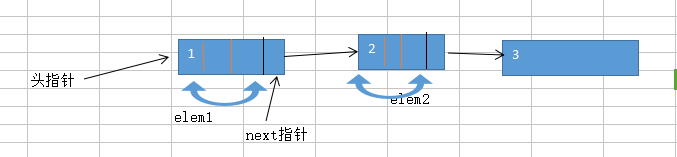
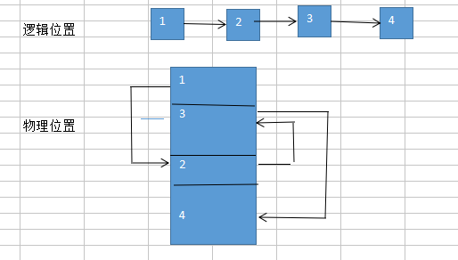
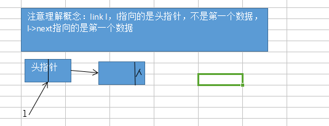
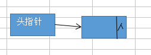
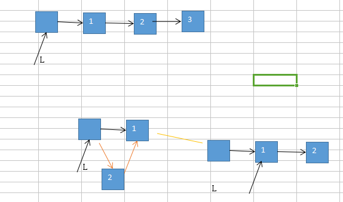
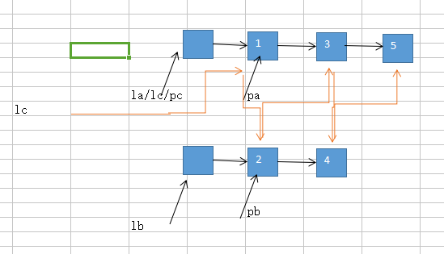
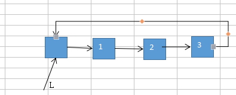

#### 链式表的表示和实现

1. 链表：逻辑位置相邻，物理位置不一定相邻，开辟连续的存储单元，或者是不连续的。





2. 链表存储结构
```c
typedef struct{
	char name[10];//学生姓名
	int age;      //学生年龄
}student;
typedef struct lnode{
	student data;
	struct lnode *next;
}lnode,*link;
```


3. 链表的操作：初始化，查找，删除，插入

（3.1）初始化及文件的导入
```c
//文件导入
int initlink(link &l){
	FILE *fp=NULL;
	link p=NULL,q=NULL;
	//1.创建空的头节点
	l=(lnode *)malloc(sizeof(lnode));
	if(l==NULL)
		return 0;
	l->next=NULL;
	q=l;
	//2.打开文件
	if((fp=fopen("student.txt","r"))==NULL)
		return 0;
	while(!feof(fp)){
		for(int i=0;i<3;i++){
			//3.每次动态开辟一个内存空间
			p=(lnode *)malloc(sizeof(lnode));
			if(p==NULL)
				return 0;
			//4.文件导入数据并更新指针
			fscanf(fp,"%s%d",p->data.name,&p->data.age);
			p->next=NULL;
			//5.为了使链表连接，用到了辅助指针p,q(q作为前指针，p作为当前的指针)
			q->next=p;
			q=p;
		}
	}
	return 1;
}
```


（3.2）查找：判断查找位置；判断是否有数据
```c
//查询学生数据(按位置进行查找)
int findlink1(link l,int i){
	//1.查找位置应该是合理的
	int k=1;
	if(i<1)
		return 0;
	//2.判断是否为空链表，如果为空的链表就不进行查找了
	link p=NULL;
	p=l->next;//p指向第一个数据元素
	if(p==NULL)
		return 0;
	//3.链表不为空的时候，使用一个辅助指针进行查找
	while(p && k<i){
		p=p->next;
		k++;
	}
	//4.跳出while循环的几种情况
	if(p){
		printf("\n%s\t%d",p->data.name,p->data.age);
		return 1;
	}
	else if(!p){
		return 0;
	}
	return 1;
}
```

时间复杂度的分析：在链表中查找某个i位置的数据，最坏的情况是T(n)=O(n),每一个都进行一次查找

（3.3）插入：完整的思考：头插，中间插，尾部插

下面的这个插入的方法存在问题：可以在头部插入，但是在最后面进行插入就不行了，应该是j满足循环条件，但是p->next为NULL了，所以就是直接插入。
```c
//添加学生信息
int insertlink(link &l,int i){
	student e;
	link p=NULL,q=NULL;
	p=l;
	int j=1;
	//1.添加的位置应该是合理的
	if(i<1)
		return 0;
	//2.输入添加的学生信息并用一个指针指向
	printf("\n请输入学生信息：\n");
	scanf("%s%d",e.name,&e.age);
	//注意这里的问题：指针使用时首先要为其开辟内存空间才可以使用，
	//p,q的初始值都是NULL,但是P=L，相当于P有了空间,而q仍为NULL，所以使用scanf进行赋值时是无法进行的。
	q=(lnode *)malloc(sizeof(lnode));
	if(q==NULL)
		return 0;
	q->data=e;
	q->next=NULL;
	//3.找到i-1的位置
	while(p->next && j<i){
		j++;
		p=p->next;
	}//退出while循环，p指向的是i前面的一个元素
	//4.退出循环只能是j不满足条件
	if(p->next)
	{
		q->next=p->next;
		p->next=q;
		printf("\n添加成功！\n");
	}
	else if(!p->next){
		printf("\n添加失败！\n");
		return 0;
	}
	return 1;

}
```

时间复杂度：插入也要先找到那个位置，考虑最坏的情况T(n)=O(n)

（3.4）删除

这个删除考虑到了头部，尾部

```c
//删除学生信息
int deletlink(link &l,int i){
	int k=1;
	//1.删除的位置应该是合理的
	if(i<1)
		return 0;
	//2.判断链表是否为空
	link p=l,q=NULL;
	if(p->next==NULL)
		return 0;
	//3.查找i-1的位置
	while(p->next && k<i){
		p=p->next;
		k++;
	}
	if(p->next){
		q=p->next;
		p->next=q->next;

	}
	else if(!p->next){
		printf("\n删除失败！\n");
		return 0;
	}
	return 1;
}

```

时间复杂度：删除的时候也是要先找到位置T(n)=O(n)

4. 课本上的例子

（4.1） 逆序生成单链表

        生成头节点

        生成第一个数据节点，头节点->next=第一个元素

        生成第二个元素，加入到头节点后面

        ...生成第n个元素，插入到头节点的后面
    
  


（4.2）将两个有序链表合并生成一个有序链表

    pc链表最开始的时候是指向某一个链表的

    分别使用三个指针，pa,pb,pc

    pa,pb分别指向两个集合中的元素，进行比较，将比较后的结果让pc指向，然后分别移动pc指针和pa或pb指针。重复比较的动作。



5. 循环链表

    方便从人一个节点开始，都可以找到任何一个节点



6. 双向链表

    无论是单项链表还是循环链表都是只可以向后移动，拿到next,如果想拿到前面的数据，就要从头开始一个个的找，
    所以为了可以方便的找到前一个元素，增加一个前指针。
    
7. 现实生活中最具有意义的一种链表的结构是：

```c
typedef struct{
	char name[10];//学生姓名
	int age;      //学生年龄
}student,*LStudent;
//将头指针，尾指针，长度存储在一个数据结构中，放在一起方便使用
typedef struct lnode{
	LStudent head,tail;//具有头尾指针
	int length;//链表的实际的长度
}linklist;
```
