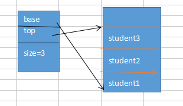
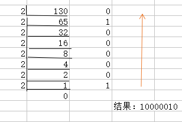

### 顺序栈

1. 定义

     栈是哦一种特殊的线性表，只是操作比线性表有了一些局限性。
     栈：先进后出，后进先出
     栈的容量也是不能进行限制的，最合适的方式是设置一个基本容量，不合适的时候扩充。

     栈的应用是：临时存储器。
 
2. 表示
```c
typedef struct{
	char name[10];  //学生姓名
	int age;        //学生年龄
}student;

typedef struct{
	student *base;
	student *top;
	int size;//栈的容量
}sqstack;
```



    base指向的是底
    top指向顶部元素的上一个地址（空的）

    bsse = NULL：栈结构不存在
    top==base:空栈
    top-base>=size"满栈

3. 操作

关于栈的基本操作是：初始化，取栈顶元素，入栈，出栈，判断栈空，栈满，栈长度

    注意：取出栈顶的元素不需要移动指针，入栈出栈：移动指针

（3.1） 初始化:动态开辟内存，判断空间情况，文件导入数据
```c
//初始化（文件导入进栈）
int initstack(sqstack &s)
{
	FILE *fp;
	//1.开辟内存
	s.base=(student *)malloc(100 *sizeof(student));
	if(!s.base)
		return 0;
	//2.建立空栈，更新栈指针和size
	s.top=s.base;
	s.size=100;
	//3.打开文件
	if((fp=fopen("student.txt","r"))==NULL)
	{
		return 0;
	}
	//4.读取文件内容并移动栈顶指针
	//利用s.base指针移动进行栈数据输入，同时移动s.top指针
	while(!feof(fp)){
		for(int k=0;k<3;k++){
			fscanf(fp,"%s%d",s.base[k].name,&s.base[k].age);
			s.top++;
		}
		
	}
	//5.关闭文件
	fclose(fp);
	return 1;
}
```

（3.2） 取出栈顶元素：注意：栈顶指针不移动

    注意：top-1:指针不移动
         top--：指针移动
         
         
```c
//取栈顶元素
int getstack(sqstack &s,student &e)
{
	//1.首先判断是否栈空
	if(empty(s))
		return 0;
	//2.取栈顶元素(注意栈指针不移动)
	e=*(s.top-1);
	return 1;
}
```

(3.3)入栈：

    判断栈满，开辟空间
    指针重新指向
    入栈，top指针移动

     注意：top-1:指针不移动
             top--：指针移动
             
             
```c
//入栈
int push(sqstack &s,student e)
{
	student *newbase;
	//1.入栈之前判断栈是否满了
	if(full(s)){
		//2.栈满时空充内存
		newbase=(student *)realloc(s.base,(s.size+10)*sizeof(student));
		if(!newbase)
			return 0;
		//3.更新栈指针和size
		s.base=newbase;
		s.top=s.base+s.size;//虽然重新开辟了新空间，但是s.top应该还是指向原来那么大的位置,因为此时还没有放入元素
		s.size+=10;
	}
	//4.插入数据
	*(s.top)=e;
	//5.更新栈顶指针
	s.top++;
	return 1;
}
```

    下面的这两句话可以替换
      *(s.top)=e;
      s.top++;

    替换为：
    *s.top++ = e;//先赋值再自增

（3.4）出栈

```c
//出栈
int pop(sqstack &s,student &e)
{
	//1.出栈前判断是否栈空
	if(empty(s))
		return 0;
	//2.栈顶元素取出
	//结构体可以进行整体赋值
	e=*(s.top-1);//注意不是e=*(S.top--)因为这里S.top指针已经移动了
	//3.更新栈顶指针
	s.top--;

	return 1;
}
```

（3.5）判断栈空，栈满,栈的长度
```c
//判断栈空
int empty(sqstack s){
	//栈空返回1
	if(s.base==s.top)
		return 1;
	return 0;
}
//判断栈满
int full(sqstack s){
	//栈满返回1
	if(s.top-s.base>=s.size)
		return 1;
	return 0;
}
//栈的长度（栈中元素的个数）
int sqlength(sqstack &s)
{
	int count=0;
	//1.判空
	if(empty(s))
		return count;
	count=s.top-s.base;
	return count;

}
```
4. 栈的应用举例

（4.1）数值转换



结果应该是逆序输出的，所以使用栈合适，如果使用数组，要考虑下标的变化。

（4.2）括号匹配的检验

[ ( [ ] ) ]:出现一个符号就和栈顶的符号进行比较，

（4.3）行编辑程序

（4.4）迷宫求解

（4.5）表达式求值


5. 栈与递归的实现

（5.1）函数

（5.2）Hanoi塔问题
