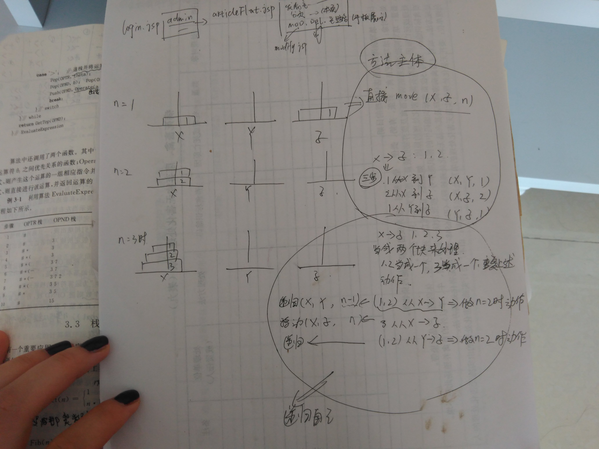

### 顺序栈

1. 定义

     栈是哦一种特殊的线性表，只是操作比线性表有了一些局限性。
     栈：先进后出，后进先出
     栈的容量也是不能进行限制的，最合适的方式是设置一个基本容量，不合适的时候扩充。

     栈的应用是：临时存储器。
 
2. 表示
```c
typedef struct{
	char name[10];  //学生姓名
	int age;        //学生年龄
}student;

typedef struct{
	student *base;
	student *top;
	int size;//栈的容量
}sqstack;
```


    base指向的是底
    top指向顶部元素的上一个地址（空的）

    bsse = NULL：栈结构不存在
    top==base:空栈
    top-base>=size"满栈

3. 操作

关于栈的基本操作是：初始化，取栈顶元素，入栈，出栈，判断栈空，栈满，栈长度

    注意：取出栈顶的元素不需要移动指针，入栈出栈：移动指针

（3.1） 初始化:动态开辟内存，判断空间情况，文件导入数据
```c
//初始化（文件导入进栈）
int initstack(sqstack &s)
{
	FILE *fp;
	//1.开辟内存
	s.base=(student *)malloc(100 *sizeof(student));
	if(!s.base)
		return 0;
	//2.建立空栈，更新栈指针和size
	s.top=s.base;
	s.size=100;
	//3.打开文件
	if((fp=fopen("student.txt","r"))==NULL)
	{
		return 0;
	}
	//4.读取文件内容并移动栈顶指针
	//利用s.base指针移动进行栈数据输入，同时移动s.top指针
	while(!feof(fp)){
		for(int k=0;k<3;k++){
			fscanf(fp,"%s%d",s.base[k].name,&s.base[k].age);
			s.top++;
		}
		
	}
	//5.关闭文件
	fclose(fp);
	return 1;
}
```

（3.2） 取出栈顶元素：注意：栈顶指针不移动

    注意：top-1:指针不移动
         top--：指针移动
         
         
```c
//取栈顶元素
int getstack(sqstack &s,student &e)
{
	//1.首先判断是否栈空
	if(empty(s))
		return 0;
	//2.取栈顶元素(注意栈指针不移动)
	e=*(s.top-1);
	return 1;
}
```

(3.3)入栈：

    判断栈满，开辟空间
    指针重新指向
    入栈，top指针移动

     注意：top-1:指针不移动
             top--：指针移动
             
             
```c
//入栈
int push(sqstack &s,student e)
{
	student *newbase;
	//1.入栈之前判断栈是否满了
	if(full(s)){
		//2.栈满时空充内存
		newbase=(student *)realloc(s.base,(s.size+10)*sizeof(student));
		if(!newbase)
			return 0;
		//3.更新栈指针和size
		s.base=newbase;
		s.top=s.base+s.size;//虽然重新开辟了新空间，但是s.top应该还是指向原来那么大的位置,因为此时还没有放入元素
		s.size+=10;
	}
	//4.插入数据
	*(s.top)=e;
	//5.更新栈顶指针
	s.top++;
	return 1;
}
```

    下面的这两句话可以替换
      *(s.top)=e;
      s.top++;

    替换为：
    *s.top++ = e;//先赋值再自增

（3.4）出栈

```c
//出栈
int pop(sqstack &s,student &e)
{
	//1.出栈前判断是否栈空
	if(empty(s))
		return 0;
	//2.栈顶元素取出
	//结构体可以进行整体赋值
	e=*(s.top-1);//注意不是e=*(S.top--)因为这里S.top指针已经移动了
	//3.更新栈顶指针
	s.top--;

	return 1;
}
```

（3.5）判断栈空，栈满,栈的长度
```c
//判断栈空
int empty(sqstack s){
	//栈空返回1
	if(s.base==s.top)
		return 1;
	return 0;
}
//判断栈满
int full(sqstack s){
	//栈满返回1
	if(s.top-s.base>=s.size)
		return 1;
	return 0;
}
//栈的长度（栈中元素的个数）
int sqlength(sqstack &s)
{
	int count=0;
	//1.判空
	if(empty(s))
		return count;
	count=s.top-s.base;
	return count;

}
```
4. 栈的应用举例

（4.1）数值转换


结果应该是逆序输出的，所以使用栈合适，如果使用数组，要考虑下标的变化。

（4.2）括号匹配的检验

[ ( [ ] ) ]:出现一个符号就和栈顶的符号进行比较，相同的时候pop出栈，一直进行

（4.3）行编辑程序

	前提：用户在数据区输入的数据的正确性是不能得到保证的，所以当输入错误的数据时，用户是希望可以得到改正的。所以不能直接将用户输入的数据直接存入到数据区，因为可能存在错误，所以最好的做法是将输入的数据先放进临时的缓冲区--->栈，数据错误的时候出栈。

	使用栈的机制：临时缓冲区就是栈。用户输入的字符先判断是什么字符（先不进栈），如果是正常的字符直接进入栈，如果是#，出栈一个字符（计算机使用的是Delete键），如果用户输入的是@，就是想删除一行，这个时候清空栈。栈满的时候就是一行数据结束的时候。

（4.4）迷宫求解

	前提：从入口进入，若能走通就继续走，若不能走通就按原路返回，保证原路是不出错的就要使用栈，用栈来存储走过的路径。

	机制：用户走一个小方格看看是否能走的通（先不放入栈中），走得通就把当前方块放入栈中（入栈），走不通的话，取栈顶元素（不是出栈），看看他其他方向的一个方块能不能走通，能走通的话将新的方块入栈，如果各个方向的方块都不能走通的话，将这个元素从栈中删除，就是出栈。这是一个循环的过程。

（4.5）表达式求值

举例：4+2*3-2 = 8

使用机制：因为运算符是有优先级的，所以计算机在运算的时候会涉及到数据的回退，使用栈。

因为有运算符的比较，所以应该使用两个栈：运算符栈，数据栈。

使用过程：如何判断输入的是数据还是运算符，所以首先定义一个运算符的集合或数组，输入一个数据如果在数组中存在就是运算符，否则就是数据。任何一个表达式都是由运算数，运算符，界定符组成的。
用户输入，首先将界定符的起始#放入符号栈中。然后输入，如果是运算数，直接存入数据栈，如果是一个运算符，先不入栈，首先判断该符号与运算符栈栈顶的符号的优先级，
栈顶的小，输入的大的时候，直接存入栈中一个新的符号，
但是，输入的符号优先级小的时候，c存储刚输入的符号，从符号栈出栈，临时放在Op中，从数据栈中出栈两个x,y,与op进行运算，将结果存入数据栈，此时刚输入的符号还在c中，c仍与符号栈顶的符号比较，重复上述的操作，注意，这是循环。循环结束的表示就是最后输入的是一个界定符结束#。

5. 栈与递归的实现

Hanoi塔问题



三个主子中木板的出入就是栈的结构，后进先出。


n个木块从x到Z：

n=1,直接移动
n>1,有一个辅助栈y,分三部走：（1）前n-1个到Y（2）第N个到Z（3）前n-1个从y到Z::
n=2,有一个辅助栈y,分三部走：（1）前n-1个到Y（2）第N个到Z（3）前n-1个从y到Z
n=3,有一个辅助栈y,分三部走：（1）前n-1个到Y（2）第N个到Z（3）前n-1个从y到Z

思考：前n-1个到y，就是递归在调用上面的三个步骤。


#### 总结

满足后退，后进先出，先后顺序导致会后退的数据的存储结构都是栈。
