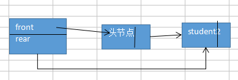

### 链式队列

1. 表示

```c
typedef struct{
	char name[10];
	int age;
}student;

typedef struct node{
	student data;
	struct node *next;
}Qnode,*Queueptr;

typedef struct {
	Queueptr front;//队头指针
	Queueptr rear;//队尾指针
}linkQueue;
```



2. 操作

```c
//队列的初始化
int initQueue(linkQueue &Q)
{
	//1.开辟内存空间
	Q.front=Q.rear=(Queueptr)malloc(sizeof(Qnode));
	if(!Q.front)
		return 0;
	//2.更新指针
	Q.front->next=NULL;//front指向的是头节点，front->next表示的不是头节点，是第一个数据
	return 1;
}
//队列判空函数
int empty(linkQueue Q){
	//队列为空的话返回1，否则返回0
	if(Q.front==Q.rear)//都是指向的头节点
		return 1;
	return 0;
}
//显示
int show(linkQueue Q){
	//1.队列不为空
	if(empty(Q))
		return 0;
	Queueptr p=NULL,q=NULL;
	p=Q.front->next;
	while(p){
		printf("%s\t%d\n",p->data.name,p->data.age);
		//注意指针的移动不可以使用p++
		q=p;
		p=q->next;
	}
	return 1;
}
//文件导入
//文件导入的实质就是在对尾一个个的插入元素
int initQueue1(linkQueue &Q){
	//1.开辟了头节点的内存空间
	initQueue(Q);
	//2.打开文件
	FILE *fp;
	Queueptr p=NULL;
	Queueptr q;
	if((fp=fopen("student.txt","r"))==NULL)
		return 0;
	while(!feof(fp)){
		//3.动态开辟节点内存
		p=(Qnode *)malloc(sizeof(Qnode));
		if(p==NULL)
			return 0;
		//4.由于头节点的数据指针类型与节点的指针类型不同，所以要单独提出来进行连接
		p->next=NULL;
		strcpy(p->data.name,"小孩");
		p->data.age=20;
		Q.front->next=p;
		q=p;
		//5.循环文件导入数据(每动态开辟一个节点内存就通过文件导入数据,然后利用前后指针进行连接)
		for(int i=0;i<4;i++){
			p=(Qnode *)malloc(sizeof(Qnode));
			if(p==NULL)
				return 0;
			fscanf(fp,"%s%d",p->data.name,&p->data.age);
			p->next=NULL;
			q->next=p;
			q=p;
		}
		//6.最后处理尾指针
		Q.rear=q;
	}
	
	//7.显示
	show(Q);
	return 1;
}


//在队尾插入元素
int enQueue(linkQueue &Q,student e)
{
	//1.不用判断队列是否满了
	Queueptr p;
	//2.动态开辟节点内存
	p=(Qnode *)malloc(sizeof(Qnode));
	if(!p)
		return 0;
	//3.在新开辟的节点中存放数据并与链表连接
	p->data=e;
	p->next=NULL;
	Q.rear->next=p;
	//4.更新尾指针
	Q.rear=p;

	//显示
	show(Q);
	return 1;
}
//删除队头元素
//删除尤其要注意的一点是：一般元素不止一个的时候，删除不需要改变尾指针，但是如果原来就只有一个元素，删除的时候，尾指针要变化，这个时候头尾指针都是应该指向头节点的。

int deQueue(linkQueue &Q, student &e)
{
	Queueptr p;
	//1.首先判断队列是否为空
	if(empty(Q))
		return 0;
	//2.辅助空间p指向第一个节点
    p=Q.front->next;
	e=p->data;
	Q.front->next=p->next;
	//3.特殊情况：判断队列中是否只有一个元素
	if(Q.rear==p)
	  Q.rear=Q.front;
	//4.释放节点内存
	free(p);//这样一来。Q.front和Q.rear都是NULL

	//显示
	show(Q);
	return 1;
}
//取队头元素
//注意：只是取出数据，队头指针不需要移动
int getQueue(linkQueue &Q,student &e)
{
	//1.首先判断队列是否为空
	if(empty(Q))
		return 0;
	e=Q.front->next->data;

	return 1;
}

//销毁队列
//删除结构，连头节点都进行删除
int de(linkQueue &Q){
	Queueptr p=NULL;
	//1.判定队列不为空
	if(empty(Q))
		return 0;
	while(!empty(Q)){
		p=Q.front->next;
		if(Q.rear==p){
			Q.rear=Q.front;
		}
		Q.front->next=p->next;
		free(p);
	}
	return 1;
}

//队列长度
int length(linkQueue Q){
	int leng=0;
	//1.判空
	if(empty(Q))
		leng=0;
	Queueptr p=Q.front->next;
	while(p){
		leng++;
		p=p->next;
	}
	return leng;
}

//队列清空
//清空数据，结构还在，就是头节点，即Q.front指向的是头节点不进行free
int clearqueue(linkQueue &Q){
	//1.判断队列是否为空
	if(empty(Q))
		return 0;
	Queueptr p=Q.front->next;
	while(p){
		Q.front->next=p->next;
		if(Q.rear==p)
			Q.rear=Q.front;
		free(p);
		p=Q.front->next;
	}

	return 1;
}
```

#### 链式队列的特点就是很方便的进行插入和删除
