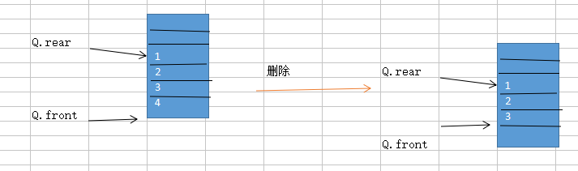
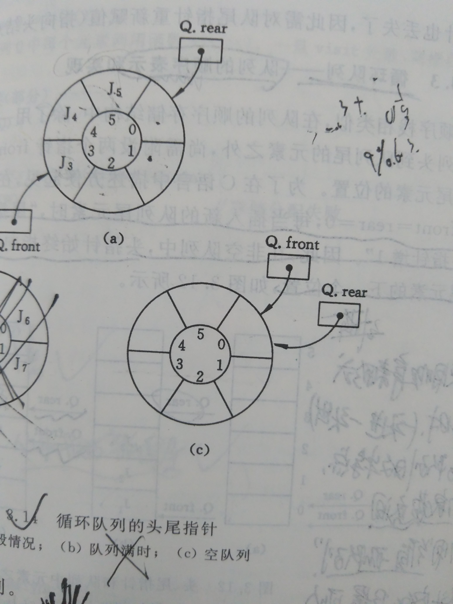

### 顺序队列->循环队列

1. 介绍：顺序存储，自然就是地址是连续的一组存储单元，注意是地址连续，不是存储单元。仍然要指明队头和队尾的标识。



观察图像可以看出来，顺序队列进行添加或者删除的时候，还是需要移动指针的，顺序存储会提前定义一个固定大小的空间，插入删除的时候会造成空间的浪费，所以最合适
的顺序存储的方式就是：循环队列




2. 定义

```c
typedef struct{
	char name[10];//学生姓名
	int age;      //学生姓名
}student;
typedef struct{
	student *data;//指向的是数组
	int front;//头尾下标
	int rear;
	int size;//顺序队列的定义的最大容量
}squeue;
```

3. 操作

    注意点：

    环形在计算的时候是比较特别的：

    （1）顺序队列是环形的
    （2）刚开始创建的时候，头尾下标指向同一位置0
    （3）队列空：Q.rear = Q.front
    （4）队列满：（Q.rear+1）%size = Q.front
    （5）添加元素后尾下标的移动标识：Q.rear = (Q.rear+1)%size;
    （6）删除元素，头下标移动Q.front = (Q.front+1)%size;
    （7）求长度：(Q.rear - Q.front + size)%size;

```c
//队列初始化
int init1(squeue &Q){
	//1.动态开辟内存
	Q.data=(student *)malloc(7*sizeof(student));
	if(Q.data==NULL)
		return 0;
	//2.初始化循环队列的“指针”
	Q.front=Q.rear=0;
	//3.更新size
	Q.size=7;

	return 1;
}


//注意区分队空和队满的判定条件


//判断队列是否为空
int empty(squeue Q){
	if(Q.front==Q.rear)
		return 1;
	return 0;
}
//判断队列是否为满
//队满的情况就是：size为5，实际填了4.size为 8，实际填了7....
int full(squeue Q){
	//队满返回1
	//*****注意写法******
	if((Q.rear+1)%Q.size==Q.front)
		return 1;
	return 0;
}
//队列长度
int length(squeue Q){
	int count=0;
	//1.队列不为空
	if(empty(Q))
		count=0;
	//****注意****
	count=Q.rear;
	return count;
}
//显示
int show(squeue Q){
	//1.队列不能为空
	if(empty(Q))
		return 0;
	//*****注意遍历循环队列范围只能是front到raer，不可以使用i,for循环*****
	while(Q.front!=Q.rear){
		printf("%s\t%d\n",Q.data[Q.front].name,Q.data[Q.front].age);
		Q.front++;
	}
	return 1;
}
//文件导入
int init2(squeue &Q){
	//1.初始化
	init1(Q);
	//2.打开文件
	FILE *fp;
	if((fp=fopen("student.txt","r"))==NULL)
		return 0;
	while(!feof(fp)){
		for(int i=0;i<4;i++){
			fscanf(fp,"%s%d",Q.data[i].name,&Q.data[i].age);
			//这样写是错误的Q.rear++;
			//3.队列“指针”移动
			Q.rear=(Q.rear+1)%Q.size;
		}
	}
	show(Q);
	return 1;
}

//入队函数(队尾)
int push(squeue &Q,student e){
	//1.判断队列是否满了
	if(full(Q))
		return 0;
	//2.插入数据
	Q.data[Q.rear]=e;
	//3."指针"移动
	//错误形式Q.rear++;
	//****注意“指针”移动的写法****
	Q.rear=(Q.rear+1)%Q.size;

	//4.显示
	show(Q);

	return 1;
}
//出队(队头)
int pop(squeue &Q,student &e){
	//1.判断队空
	if(empty(Q))
		return 0;
	//2.取出
	e=Q.data[Q.front];
	//3."指针"移动
	//这种写法错误：Q.front++;
	Q.front=(Q.front+1)%Q.size;

	//4.显示
	show(Q);

	return 1;
}

//取队头元素
int get(squeue Q,student &e){
	//1.队列不为空
	if(empty(Q))
		return 0;
	//2.取元素
	e=Q.data[Q.front];

	//3.注意“指针”不移动

	return 1;
}

```


4.应用举例


