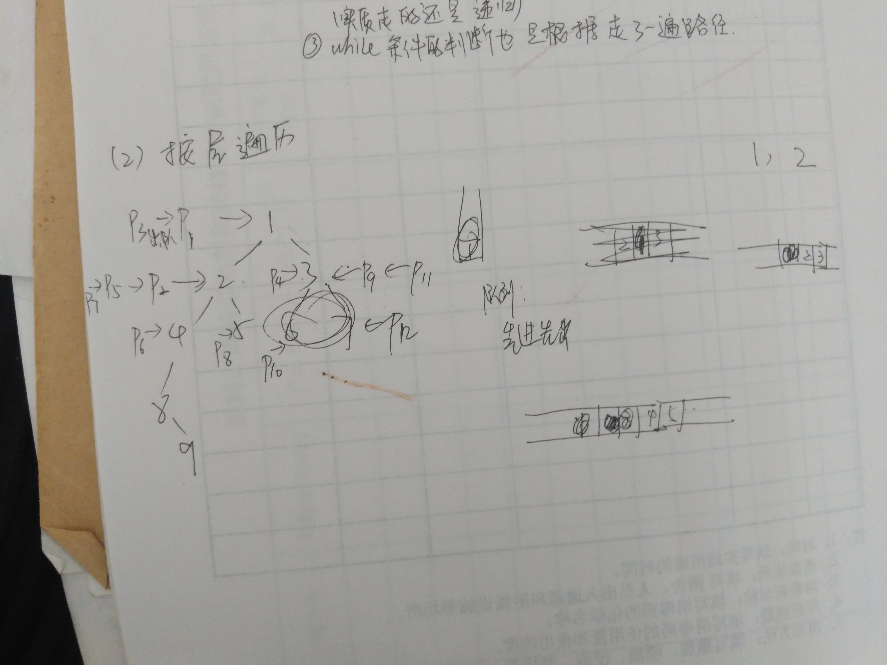

### 二叉树

1. 定义

树是非线性的结构。

树：只有一个根，节点互不相交。

2. 概念

        节点的度：该节点下面的子树的数目
        树的度：所有节点的度的最大值
        层次：根为1层
        树的深度：层次的个数

 
 

      二叉树：节点的度或者说树的度最大为2
      满二叉树：从上到下，从左到右，都是按顺序的，满的。是特殊的完全二叉树
      完全二叉树：与满二叉树的定义是类似的，除了缺少的部分，从上到下，从左到右，都是按顺序的，不一定是满的。
    
   
    
 
   
    

3. 性质：5条（课本）

4. 存储结构

（4.1）顺序存储

      从上到下，从左到右，把每一个节点进行编号，编号与数组的下标相对应，从0开始。

      这样存储存在一个浪费空间的问题


（4.2）链式存储


 
 
 ```c
 //树的定义
typedef struct tree1{
	char data;
	struct tree1 *lchild,*rchild;
	int rvisited;//当前节点的右孩子是否被访问了（该属性在树的非递归后跟遍历时会用到）
}treenode,*treelink;
 ```

5. 操作

关于树的操作，尤其要注意的是：：：：逻辑逻辑----->理清楚思路

（5.1）树的创建及数据的导入

    以前接触的链表会有一个链表首指针，但是树是没有的，而且是有左右两个指针的，为了方便操作，要将每一个节点放进一个临时数组p中，节点的下标与数组的下标相对应，使用从1开始的。

    输入一个数据就为其开辟一个node,但是这个node需要知道他的父亲是谁，它是左孩子还是右孩子。因为不能立刻判断出来，所以就要使用一个临时的存储空间数组P.
    输入的数据在合理的范围内，在二叉树中每一个数据的位置都是固定的，有顺序的，所以他们都是有标号的。根上的标号是1.为了表示输入的数据的位置，输入的时候除了输入数据，还要输入他的序号。

    序号是1是根，不是1就是一般的节点，这时要判断父亲，要判断是父亲的左孩子还是右孩子。因为是有顺序的，所以找父亲与判断是左右孩子就要根据编号，这样简单。


逻辑逻辑：

（1）循环（2）存储（3）关系
（1）输入很多数据：while循环，判断条件是 0，#
（2）每输入一个就开辟一个Node
（3）节点之间通过父子关系进行连接，数据必需有一个临时存储的地方，因为有下标，直接使用数组


```c
//创建一棵树，返回树根
//******注意创建一棵树时需要一个辅助空间p*********
treelink creattree()
{    treelink t,s;
     int I,j;
	 char ch ;
	 //1.首先输入一个数节点信息
	 //树按层有编号和字符
	 //****注意有树输入停止的标志****

	 printf ("input I  , ch :");
	 //*****注意scanf有,则在控制台也要输入,
     scanf("%d,%c",&I,&ch);

	 //因为要循环输入节点，所以使用循环

     while (I!=0&& ch!='#')
     {   
		 //2.创建节点并初始化该节点
		 s=(treenode*) malloc (sizeof(treenode));
          s->data=ch;
          s->lchild=NULL;
          s->rchild=NULL;

		  //3.把创建的树节点的地址根据创建时的编码存在数组p中
          p[I]=s;   
		  
		  //4.判断输入的节点是否为跟节点（根据输入时的编号）
		  if (I==1) 
	       t=s; //树根

		  //5.如果不是跟节点就要判断是左子树还是又子树（根据输入时的编号），并找到父类的编号，进行连接
          else
           {   j=I/2; //结点I双亲
               if (I%2==0)    p[j]->lchild=s;
               else           p[j]->rchild=s;
            }
		  //6.继续输入数据
          printf ("input I   ch :"); 
          scanf("%d,%c",&I,&ch);
    }    
	 //endwhile
   return t ;
}

```

（5.2）树的遍历算法

    树本身是非线性的，但是遍历的算法实际上就是实现线性序列的输出。


（5.2.1）递归遍历

```c
//用递归先根遍历
//遍历哪颗树啊，所以要把树的指针传进来
void pre(treelink t)
{
	//1.遍历的前提是：不是空树
	//一个个节点的遍历应该是循环的，但是这里采用递归的形式，所以这里使用if
	if(t)
	{
		//2.先输出跟节点的数据
		printf("%c ",t->data);
		//3.左子树以相同的遍历方式遍历，递归
		pre(t->lchild);
		//4.右子树以相同的遍历方式遍历，递归
		pre(t->rchild) ;
	}
}
//中根遍历
void mid(treelink t)
{
	//1.遍历的前提是：不是空树
	//一个个节点的遍历应该是循环的，但是这里采用递归的形式，所以这里使用if
	if(t)
	{
		//1.首先接触到的是跟，不能输出数据，访问左孩子采用相同的遍历方式
		mid(t->lchild);
		//2.然后是跟数据的读取
		printf("%c ",t->data);
		//3.访问右孩子，右孩子递归（同样的遍历方法）
		mid(t->rchild) ;
	}
}
//后根遍历
void last(treelink t)
{
	//1.遍历的前提是：不是空树
	//一个个节点的遍历应该是循环的，但是这里采用递归的形式，所以这里使用if
	if(t)
	{
		//2.由于首先接触到的是跟，所以不能读取数据，要递归调用方法（遍历左孩子还是用相同的遍历方法）
		last(t->lchild);
		//3.然后右孩子进行遍历（采用相同的遍历方式）
		last(t->rchild) ;
		//4.左右孩子读取完了之后就是跟数据的读取
		printf("%c ",t->data);
	}
}

```
（5.2.2）非递归遍历

关于用到的判定条件不好理解的，走几遍或者根据：push(p),p就不能为空，pop(s),栈 就不能为空，还要区分while条件使用的是||,或者

```c
//非递归先根遍历(传统的借助栈进行遍历)
void pre2(treelink t)
{
	treelink p=t;
	SqStack S;

	//1.创建一个辅助栈
	initSqStack(S);

	//2.在指向树的指针不为空或栈不为空的情况下循环遍历
	//*******注意该条件起初时栈肯定是空的，所以起初保证了树不能为空
	while(p || !empty(S))
	{
		//3.指针不为空的时候
		if(p)
		{
			//4.首先输出跟节点的数据并入栈
			printf("%c",p->data);
			push(S,p);
			//5.然后指针指向左孩子，实际上为左子树，做相同的遍历和判断
			p=p->lchild;
		}
		//6.如果此时指向的指针为空，说明达到了左端点，此时要出栈对右孩子进行判断
		//*****注意这里是一个不容易理解的问题：即使是到达最左边的节点也要看作树，要访问左孩子和右孩子
		else
		{
			p=pop(S);
			p=p->rchild;
		}
	}
}


//非递归中根
void mid2(treelink t)
{
	treelink p=t;
	SqStack S;

	//1.首先初始化一个辅助空间栈
	initSqStack(S);

	//2.在栈不为空或树指针不为空的情况下进行循环遍历
	//*******注意该条件起初时栈肯定是空的，所以起初保证了树不能为空
	while(p || !empty(S))
	{
		//3.指针不为空时，进栈并不断指向其左孩子
		if(p)
		{
			push(S,p);
			p=p->lchild;
		}
		//4.指针为空的时候栈不空
		else
		{
			//5.从栈中取出元素，取出的元素就是最左端的元素或跟元素，所以进行输出
			p=pop(S);
			printf("%c",p->data);
			//6.同理输出后，最左端的节点也要看作一棵树，继续访问右孩子
			p=p->rchild;
		}

		//上述的左孩子和右孩子都要进行循环的过程
	}
}


//非递归后跟遍历
//*******非递归后跟遍历是一个难点*******
//可能很难理解
void End(treelink t)
{
	SqStack S;
	treelink p;
	p=t;
	treelink q;//栈顶元素

	//1.初始化一个辅助栈
	initSqStack(S);

	//2.指针不为空时
	//这里是循环一直走到最左侧才开始进行访问
	//首先树不能为空
	while(p)
	{
		//3.进栈并设置当前节点的右孩子没有被访问的标志rvisited=0，然后仍然指向左孩子
		push(S,p);
		p->rvisited=0;
		p=p->lchild;
	}

//右孩子空与不空的处理方式是不同的，所以要单独写出来

	//退出上面的一个循环是已经到达最左侧的节点了
	//4.在栈不为空时
	while(!empty(S))
	{
		//5.取得栈顶元素
		//*****注意这里不是出栈，因为最左端的元素也可能是跟，他可能有右孩子
    //不能是出栈，因为还没有输出根上的数据呢
		q=GetData(S);

		//6.如果栈顶元素的右孩子已经被访问了或没有右孩子，此时就应该访问它的兄弟即它双亲的右孩子了
		if(q->rvisited || q->rchild==NULL)
		{
			//7.出栈读取数据
			p=pop(S);
			printf("%c",p->data);
		}
		//8.如果有右孩子，要首先访问右孩子，注意rvizited的值要进行更新
		else
		{
			//8.1更新rvizited的值，并指向右孩子判断右孩子的情况（肯定没有左孩子）
			q->rvisited=1;
			p=q->rchild;
			//8.2如果右孩子存在，进栈，更新rvizited,继续指向左孩子，对左孩子做相同的循环判断操作
			while(p)
			{
				push(S,p);
				p->rvisited=0;
				p=p->lchild;
			}
		}
		
	}//退出说明栈已经为空了
}
```

（5.3）叶子的个数
```c
//树叶数目	
int leafcount(treelink t)
{
	//1.思考树的叶子数应该是左子树与右子树的叶子数之和，所以定义了一个静态的变量，用来存储叶子数（也可以使用全局变量）
	//******注意后面会使用++的自增运算符，所以count要有一个初始值
	static int count=0;
	
	//2.判断是否为空树
	if(t)
	{
		//3.左子树有一个count
		leafcount(t->lchild);
		//4.右子树有一个count
		leafcount(t->rchild) ;
		//5.该句也可以写在最前面，判断是否为叶子
    //只有树根的时候叶子的个数就是1
		if(t->lchild==NULL&&t->rchild==NULL)
			count++;

	}
	return count ;
}

```

（5.4）树的深度
```c
//求树深度
int deepth(treelink t)
{
	//1.定义一个存储树的深度的变量（存储空间）
	int p=0,q=0;//树的深度给出初始值，否则无法进行加1的操作

	//2.判断树是否为空
	if(t)
	{
		//3.左子树的深度和右子树的深度（因为该方法要使用返回值，所以不用设置static值）
		p=deepth(t->lchild);
		q=deepth(t->rchild);
	}
	//4.左子树的深度与右子树的深度比较，大的值作为树的深度
	return p>q ? p:q +1;
}

```

（5.5）按层遍历二叉树

他这里使用的是父节点，左右节点分别是不同的指针，因为他每次是直接从队列中出队列。但是也可以就使用两个指针，就是第一个是从队列首部读出一个数据，不拿出

来，第二次是取出。


逻辑逻辑：

队列
每一个节点都看作树


```c
//按层遍历二叉树
int laytree(treelink t)
{
	LinkQueue Q;
	treelink p=t;
	treelink q1=NULL,q2=NULL;//q1指向左孩子，q2指向右孩子

	//1.初始化一个辅助队列
	//通过画图可以看出按层遍历的过程就是需要队列这种辅助空间
	initQueue(Q);

	//2.判定树是否为空
	if(!p)
		return 0;

	else
	{
		//3.开始访问，输出数据，并把该指针存入队列中
		printf("%c",p->data);
		inQueue(Q,p);	
	}
	//4.开始循环遍历树
	//*****注意遍历的条件是指向的节点不为空，队列不为空
  //每次出栈的时候应该保证栈非空，所以这里加上了这个条件
	while(p || !emptyQueue(Q))
	{
			//*******注意这里是一个难点*******

			//这个条件是在最后循环完的时候发现的条件
      if(p && emptyQueue(Q)){
				return 0;
			}

			//5.从队列中取出元素（从队列中取出的元素都是双亲，为了是访问它的左孩子和右孩子）
			p=outQueue(Q);

			//6.先取出左孩子，在左孩子存在的情况下输出访问并进队
			q1=p->lchild;
			if(q1)
			{
				printf("%c",q1->data);
				inQueue(Q,q1);
			}

			//7.取出右孩子，在右孩子存在的情况下输出访问并进队
			//注意这里是一个不易思考的难点：p=outQueue(Q)这是错误的。因为每次从队列中取出一个元素，
			//它是双亲，然后我们的目的是得到左孩子和右孩子，所以从队列中取出的元素是用一个指针，左孩子和右孩子再分别用其他的两个指针
			q2=p->rchild;
			if(q2)
			{
				printf("%c",q2->data);
				inQueue(Q,q2);
			}
		
	}
	return 1;
}

```

非递归先跟遍历：

 

按层遍历



6. 线索化二叉树


    看图，链式存储的结构可以看出如果没有左孩子或者右孩子，左右指针域就是空闲的，就会造成大量的空间的浪费。并且遍历的时候实际上就是线性化进行输出，所以想利用一下左右孩子的指针域，防止浪费空间。
    
（6.1）线索化二叉树的结构

    增加了两个字段来指明是否有左孩子还是是否有右孩子，没有左孩子的时候左指针不再是为空（浪费空间），而是指向线性序列输出应该指向的后继元素。

    结构：


普通的树的遍历（先根，中根，后根）都是按照孩子进行遍历的，序列化的遍历，没有左孩子左孩子就是前驱，没有右孩子右孩子就是后继，避免了空间的浪费。

（6.2）创建树
    创建的树的是否有左右孩子的标记先都临时设置为0，序列化的时候再进行修改。

```c
//1.创建一棵树
//******注意创建一棵树时需要一个辅助空间p*********
treelink creattree1()
{    treelink t,s;
     int I,j;
	 char ch ;
	 //1.首先输入一个数节点信息
	 //树按层有编号和字符
	 //****注意有树输入停止的标志****

	 printf ("input I  , ch :");
	 //*****注意scanf有,则在控制台也要输入,
     scanf("%d,%c",&I,&ch);

	 //因为要循环输入节点，所以使用循环

     while (I!=0&& ch!='#')
     {   
		 //2.创建节点并初始化该节点
		 s=(treenode*) malloc (sizeof(treenode));
          s->data=ch;
          s->lchild=NULL;
          s->rchild=NULL;

		  //所有新建立的节点的这两个值都初始化为0
		  s->lc=0;
		  s->rc=0;
		  //3.把创建的树节点的地址根据创建时的编码存在数组p中
          p[I]=s;   
		  
		  //4.判断输入的节点是否为跟节点（根据输入时的编号）
		  if (I==1) {
			t=s; //树根
		  }

		  //5.如果不是跟节点就要判断是左子树还是又子树（根据输入时的编号），并找到父类的编号，进行连接
          else
           {   j=I/2; //结点I双亲
		  if (I%2==0){
			  p[j]->lchild=s;
		  }
               else           p[j]->rchild=s;
            }
		  //6.继续输入数据
          printf ("input I   ch :"); 
          scanf("%d,%c",&I,&ch);
    }    
	 //endwhile
   return t ;
}
```

（6.3）中序序列化和遍历

区分：

    中序序列化不是遍历，而是对是否有左右孩子的标记进行实际的初始化。
    中序遍历是按照序号好的树，对其进行遍历。


中序线索化：

思路就是使用原来的中序遍历的算法，但是不是输出，是进行初始化是否有左右孩子的标记。

```c
//2.中序线索化
//实际上中序线索化的函数方法与非递归的中序遍历的方法大体上是相同的，只有把原来的printf语句换成vizit()函数
//visit函数实际上就是： if(pre&&pre->rchild==NULL)
//						{	pre->rc=1; pre->rchild=p ; }
//						if(p->lchild==NULL)
//						{	p->lc=1; p->lchild=pre ;  }

//然后也增加了一个前指针。


int midindex(treelink &bt)
{   
	treelink p=bt ;  
	treelink pre=NULL;//前指针
	SqStack S;

	//1.首先树不能为空
    if (!p) return 0;

	//2.初始化辅助栈
    initSqStack(S);

	//3.在指针不为空或栈不为空的时候进行循环遍历
	while (p|| !empty(S)){
		
		//4.中序遍历首先一直向左（进栈同时保证元素指针不为空）
		if (p){ 
               push(S,p);   
               p=p->lchild;
			}
		//5.指针为空，说明已经达到最左边，此时需要出栈p，先对前驱元素指针进行线索化，再对出栈的指针进行线索化。
		else {
				  //5.1出栈
                  p=pop(S); 

				  //*********对前驱元素进行线索化
				  //5.2该元素p有前驱指针，并且前驱指针没有右孩子,设置右孩子标志rc=1,根据中序遍历的规则，右孩子一定是该元素p后面的，
				  //所以在前驱指针没有右孩子的情况下，根据线索化（充分利用空指针域），它的右孩子是后继p
                  if(pre&&pre->rchild==NULL)
				  {	pre->rc=1; pre->rchild=p ; }//这里的右孩子即看做后继

				  //对当前元素进行线索化
				  //5.3如果左孩子为空，lc=1,根据线索化的规则，没有左孩子，则“左孩子”为前驱
				  if(p->lchild==NULL)
				  {	p->lc=1; p->lchild=pre ;  }

				  //然后更新前驱，设置当前元素为前驱，开始向右孩子探索 
                  pre=p;     
                  p=p->rchild; 
		}
      }

	//
   return 1;
}
```
    
中序遍历:

```c
//3.对中序线索后的二叉树进行中序遍历
void mid_indextree(treelink root)
{
	treelink p=root;

	//1.首先树不能为空
	while(p)
	{
		//2.中序遍历的规则还是先一直向左遍历到最左边
		//有孩子时一直向左
		while(p->lc==0)
			p=p->lchild;

		//3.然后是输出中间（跟）或最左边的信息
		printf("%c",p->data);

		//4.然后是右孩子，要判断是否有右孩子
		//如果有右孩子对右孩子进行相同的中序遍历
		//如果没有右孩子，则要一直遍历输出后续数据

		//*******注意一直访问后继，因为已经不可能再有左孩子了************
    //如果没有右孩子，右孩子就是后继，实际上就是上一层的跟，然后该跟的右孩子了。
		while(p->rc==1)
		{
			p=p->rchild;
			printf("%c",p->data);
		}
		p=p->rchild;//这里就是最外部使用while循环的原因。右子树也要用这种算法
			
	}
}
```
    
    
    
