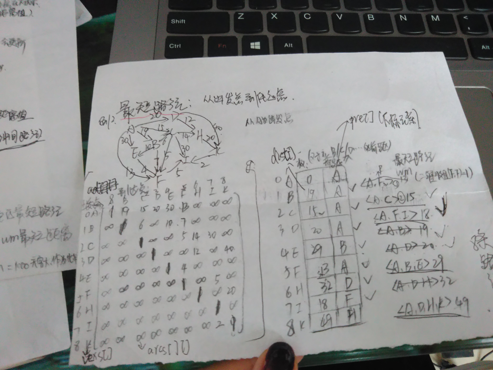
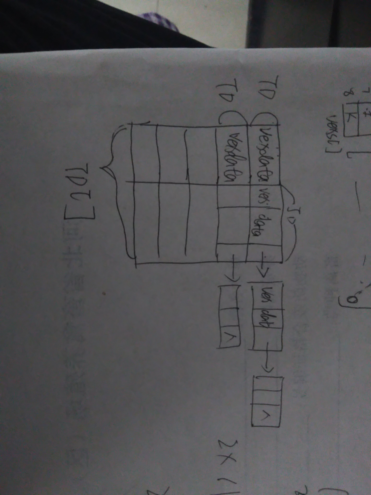

### 图的深度广度遍历

图的遍历不涉及到距离，使用的是邻接表的存储结构

1. 结构：



```c
//注意对图结构的定义必需明确知道顶点数和边数
//可以作为图的结构体成员，也可以定义为全局变量

//图的邻接表存储
typedef struct tnode
{
	int vex;
	int data;//各条边的权值
	struct tnode *next;
}JD;//链表结点
typedef struct
{
	elemtype vexdata;
	JD *firstarc;//注意：这里是指针类型
}TD;//表头结点
```



2. 操作：

```c
//图遍历的算法采用：链式存储


//遍历算法遇到的问题：
//1.遍历时输出结果有重复。问题出现的原因是：
//原来的函数原型：int DOS(TD g[],int i);
//				  int BOS(TD g[],int i,Queue Q);

//修改之后的函数：int DOS(TD g[],int i,int visit[]);
//				  int BOS(TD g[],int i,Queue Q,int visit[]);

//即使visit[]定义为全局变量，在上述函数中改变visit[]的值但是递归调用时visit[]的值还是没有改变。所以更新之后的函数方法要把visit[]数组传进去。

```

（1）创建图

创建图的思路：


```c
//*****注意创建链表图时，每次创建一个节点时插入到前面而不是后面
//（画图时这点不注意很容易出错，会导致遍历算法电脑上得到的结果与自己画图得到的结果不同）
//**********注意：参数为数组时函数结束时，数组的值会改变，不用添加"&"符号*****
int CreatGraph(TD g[])
{
	int i,j;
	int data;//代表输入的权值信息
	JD *p;//指向链表结点的指针
	int m,n;//输入字符的位置
	elemtype ch1,ch2;
	int Local(TD g[],elemtype ch);//函数的原型声明
	printf("对表头结点进行初始化：\n");
	//getchar();//漏掉不可 因为main函数中此方法前面有scanf语句


	//1.首先初始化表头结点
	//限制是顶点数
	for(i=1;i<=vexnum;i++)
	{
		scanf("%c",&g[i].vexdata);
		g[i].firstarc=NULL;

		//*****注意吃掉回车符******
		getchar();
	}

	//2.初始化链表节点
	//限制是边数
	printf("请输入边的起点、终点和对应边的权值：\n");
	for(j=1;j<=arcnum;j++)
	{
		//这些需要使用辅助空间，即变量ch1,ch2,data
		//2.1输入起点终点和对应权值
		scanf("%c%c%d",&ch1,&ch2,&data);

		//2.2获取输入顶点的下标
		m=Local(g,ch1);
		n=Local(g,ch2);

		//2.3为新输入的数据动态开辟一个空间
		p=(JD *)malloc(sizeof(JD));
		if(p==NULL)
			return 0;

		//2.4初始化链表节点的vex和data数据
		p->vex=n;
		p->data=data;

		//2.5对于链表节点的next及连接情况需要谨慎
		//需要分情况：(1)图节点的firstarc域本身有数据，不是空的
		if(g[m].firstarc!=NULL)
		{

			//********这里可以看作单链表的插入操作，只不过插入的位置是链表的首位置********
			p->next=g[m].firstarc;
			g[m].firstarc=p;
		}

		//(2)图节点的firstarc域本身没有数据，是空的
		else
		{
			p->next=NULL;
			g[m].firstarc=p;
		}

		//*********注意：吃掉回车符，这里是容易忽略的***********
		getchar();
	}
	return 1;
}

```


