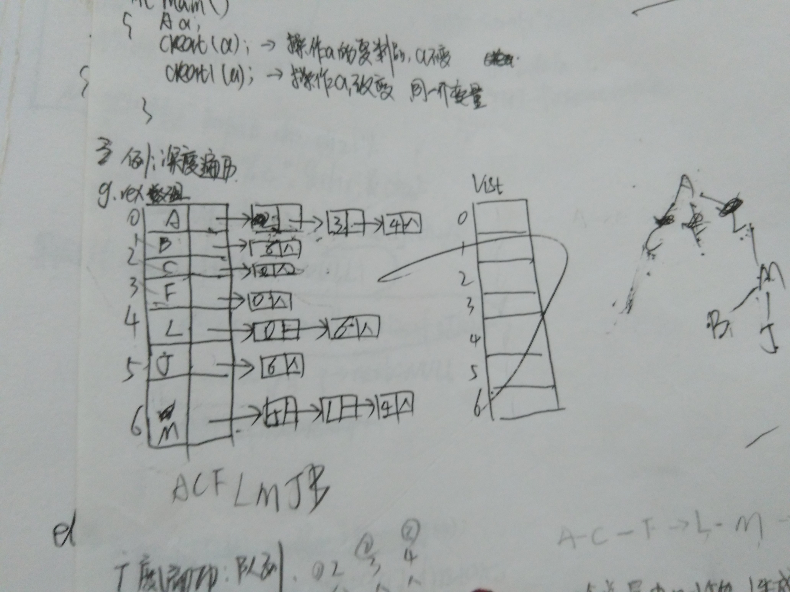
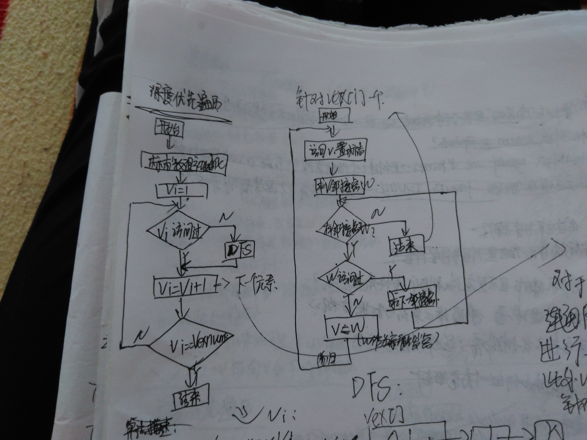
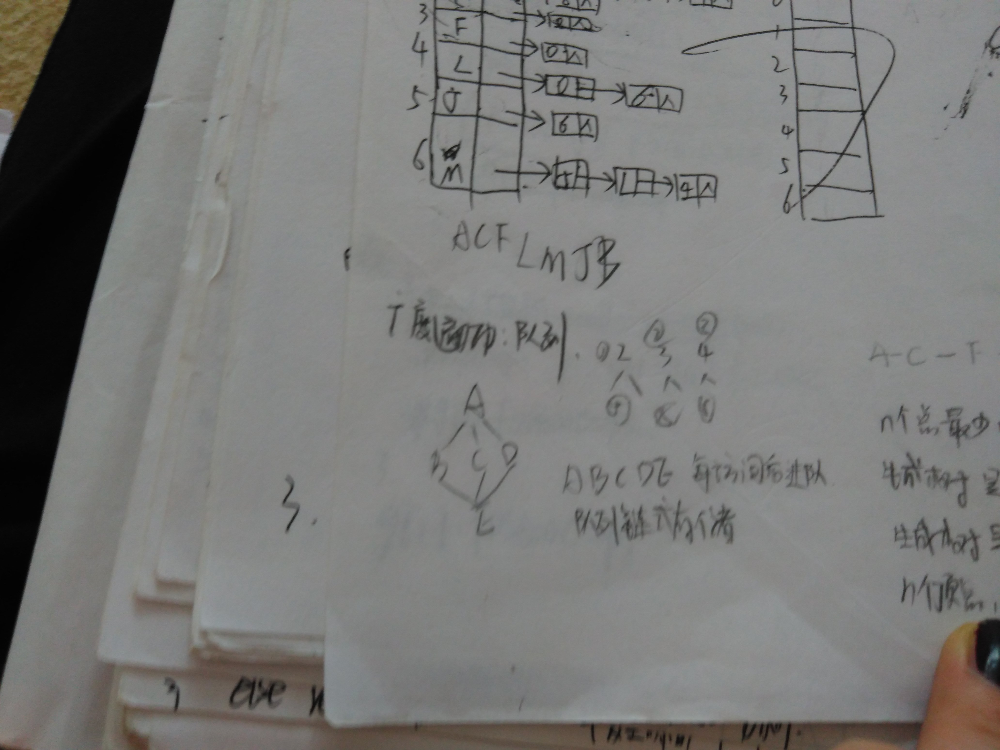
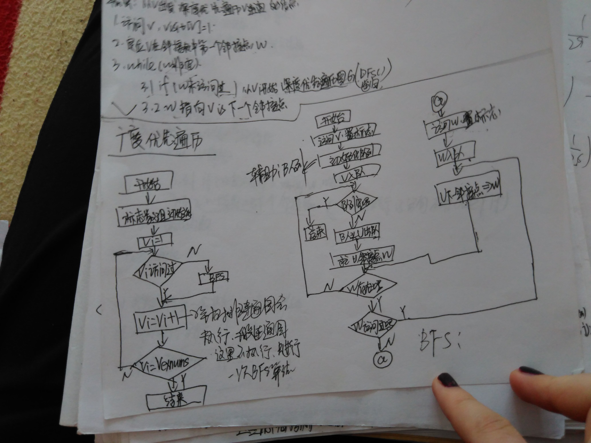

### 图的深度广度遍历

图的遍历不涉及到距离，使用的是邻接表的存储结构

1. 结构：


```c
//注意对图结构的定义必需明确知道顶点数和边数
//可以作为图的结构体成员，也可以定义为全局变量

//图的邻接表存储
typedef struct tnode
{
	int vex;//数据的下标
	int data;//各条边的权值
	struct tnode *next;
}JD;//链表结点
typedef struct
{
	elemtype vexdata;//输入的数据
	JD *firstarc;//注意：这里是指针类型
}TD;//表头结点


vexnum：顶点数
arcnum:边数
```


2. 操作：

```c
//图遍历的算法采用：链式存储


//遍历算法遇到的问题：
//1.遍历时输出结果有重复。问题出现的原因是：
//原来的函数原型：int DOS(TD g[],int i);
//		int BOS(TD g[],int i,Queue Q);

//修改之后的函数：int DOS(TD g[],int i,int visit[]);
//		int BOS(TD g[],int i,Queue Q,int visit[]);

//即使visit[]定义为全局变量，在上述函数中改变visit[]的值但是递归调用时visit[]的值还是没有改变。所以更新之后的函数方法要把visit[]数组传进去。

```

（1）创建图


创建图的思路：

	循环对vexdata初始化
	输入节点之间的信息，根据信息创建节点m->n
	将节点插入到合适的位置,原来没有链条的后面或者有链条的时候插在头部


```c
//*****注意创建链表图时，每次创建一个节点时插入到前面而不是后面
//（画图时这点不注意很容易出错，会导致遍历算法电脑上得到的结果与自己画图得到的结果不同）
//**********注意：参数为数组时函数结束时，数组的值会改变，不用添加"&"符号*****
int CreatGraph(TD g[])
{
	int i,j;
	int data;//代表输入的权值信息
	JD *p;//指向链表结点的指针
	int m,n;//输入字符的位置
	elemtype ch1,ch2;
	int Local(TD g[],elemtype ch);//函数的原型声明
	printf("对表头结点进行初始化：\n");
	//getchar();//漏掉不可 因为main函数中此方法前面有scanf语句


	//1.首先初始化表头结点
	//限制是顶点数
	for(i=1;i<=vexnum;i++)
	{
		scanf("%c",&g[i].vexdata);
		g[i].firstarc=NULL;

		//*****注意吃掉回车符******
		getchar();
	}

	//2.初始化链表节点
	//限制是边数
	printf("请输入边的起点、终点和对应边的权值：\n");
	for(j=1;j<=arcnum;j++)
	{
		//这些需要使用辅助空间，即变量ch1,ch2,data
		//2.1输入起点终点和对应权值
		scanf("%c%c%d",&ch1,&ch2,&data);

		//2.2获取输入顶点的下标
		m=Local(g,ch1);
		n=Local(g,ch2);

		//2.3为新输入的数据动态开辟一个空间
		p=(JD *)malloc(sizeof(JD));
		if(p==NULL)
			return 0;

		//2.4初始化链表节点的vex和data数据
		p->vex=n;
		p->data=data;

		//2.5对于链表节点的next及连接情况需要谨慎
		//需要分情况：(1)图节点的firstarc域本身有数据，不是空的
		if(g[m].firstarc!=NULL)
		{

			//********这里可以看作单链表的插入操作，只不过插入的位置是链表的首位置********
			p->next=g[m].firstarc;
			g[m].firstarc=p;
		}

		//(2)图节点的firstarc域本身没有数据，是空的
		else
		{
			p->next=NULL;
			g[m].firstarc=p;
		}

		//*********注意：吃掉回车符，这里是容易忽略的***********
		getchar();
	}
	return 1;
}

```

（2）其他函数

```c
//判断字符在邻接表中的位置
int Local(TD g[],elemtype ch)
{
	int i;
	int k=-1;
	
	//1.遍历图进行查找
	for(i=1;i<=vexnum;i++)
	{
		//2.如果找到相同的elemtype类型数据，用k这个辅助空间临时存储
		//*****注意找到后要及时的退出循环*********
		if(g[i].vexdata==ch)
		{
			k=i;
			break;
		}
	}

	//3.词句作为是否找到数据所在位置的判断标志
	if(k==-1)
		printf("没有找到匹配的字符！");
	return k;
}

```

（3）深度遍历

思路：

	如果整个图是连通的，那么就需要一次遍历就可以遍历完，但是有的图是非连通图，所以为了保证每一个点都遍历到，使用循环，从任意一个点开始进行深度遍历的算法（封装起来的算法）。

	深度遍历算法的实质是进行递归调用的，从i点开始，因为邻接表（无向图）存在重复的节点，所以遍历的时候要判断是否已经遍历过(visit[]).遍历的时候指针p的移动可能到NULL，这个时候就要返回到上一层去，就是方法 的结束。A到B，然后从B开始继续深度遍历（递归）。





```c
//深度遍历
//这里用到一个辅助空间数组visit[]，用来存储数据是否已经被访问的标志
int	DeepLook(TD g[],int visit[])
{
	int i;
	int DOS(TD g[],int i,int visit[]);

	//1.初始化visit[]数组,假定每一个数据均没有被访问
	for(i=1;i<=vexnum;i++)
	{
		visit[i]=0;
	}

	//2.开始遍历
	//一个个的点开始遍历
	//遍历的原则是：如果不是连通图，则遍历表头节点的每一个数据。如果是一个连通图的化，此循环实际上只会执行一次
	int j=0;
	for(j=1;j<=vexnum;j++)
	{
		//***注意进行判断****
		//这个点如果没有遍历的话，进行深度遍历
		if(visit[j]==0)
			DOS(g,j,visit);
	}
	return 1;
}

//从i位置开始深度遍历图g
int DOS(TD g[],int i,int visit[])
{
	int k;//链表中的数据位置
	JD *p=g[i].firstarc;

	//1.visit标志数组要进行更新，同时输出遍历到的数据
	visit[i]=1;
	printf("%c",g[i].vexdata);

	//2.开始深度遍历，这里肯定是一个循环，判断条件是链表节点不为空
	while(p)
	{

		//3.这里需要注意的几点：
		//（1）灵活使用辅助空间如：k，方便进行操作
		//（2）要充分利用辅助空间数组visit[],每次遍历之前先通过visit[]数组判断是否已经遍历过了
		//（3）使用递归。以每次访问到的链表节点为起点进行深度遍历，过程思路是一样的，所以使用递归更简单方便
		k=p->vex;
		//这个点没有遍历的话，从这个点继续开始深度遍历
		if(visit[k]==0)
			DOS(g,k,visit);//递归

		//如果访问过了就访问链表中的下一个相邻节点
		p=p->next;
	}
	return 1;
}
```


（4）广度遍历

思路：

	从任意一个点开始就可以进行广度遍历的算法

	邻接表的无向图存在节点的重复，所以需要设置visit[]是否已经访问过的标志，广度遍历就是类似于按层遍历，进队出队。




```c
//广度遍历
//这里用到一个辅助空间数组visit[]，用来存储数据是否已经被访问的标志
//同时用到辅助队列
int WildLook(TD g[],int visit[])
{
	int i;
	Queue Q;
	int BOS(TD g[],int i,Queue Q,int visit[]);//全局变量

	//1.初始化辅助队列
	InItQueue(Q);


	//2.初始化visit[]数组,初始值均为0
	for(i=1;i<=vexnum;i++)
	{
		visit[i]=0;
	}
	

	//3.开始遍历
	//遍历的原则是：如果不是连通图，则遍历表头节点的每一个数据。如果是一个连通图的化，此循环实际上只会执行一次

	for(i=1;i<=vexnum;i++)
	{
		if(visit[i]==0)
			BOS(g,i,Q,visit);
	}
	return 1;
}


//从位置i开始进行广度遍历
int BOS(TD g[],int i,Queue Q,int visit[])
{
	int k,j;//从队列中取出数据
	JD *w;

	//1.更新visit[]数组并输出访问到的数据,并进入队列
	visit[i]=1;
	printf("%c",g[i].vexdata);
	InQueue(Q,i);

	//2.每次访问一个数据进队，然后紧接着指针移动到链表的每一个节点
	//注意判断队列不能为空 访问到的节点不能为空
	while(!Empty(Q))
	{
		k=OutQueue(Q);
		w=g[k].firstarc;
		while(w)
		{
			j=w->vex;

			//注意每次访问到之前根据visit[]数组判断是否已经进行过访问了
			if(visit[j]==0)
			{

				//访问输出数据，更新visit[],并进队
				printf("%c",g[j].vexdata);
				visit[j]=1;
				InQueue(Q,j);
			}
			
			//指针移动
			w=w->next;
		}
	}
	return 1;
}

```


