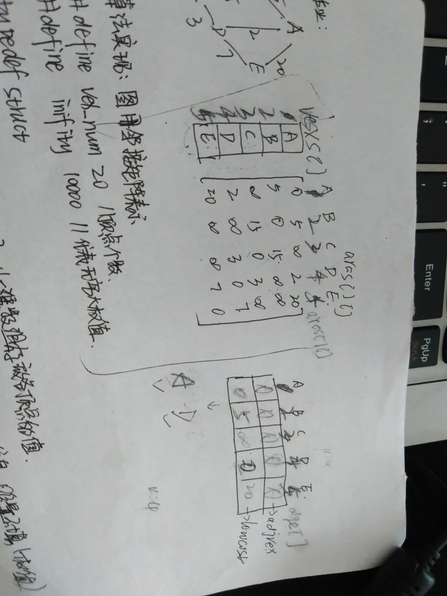

### 图的最小生成树

    最小生成树是用和最少的边集将一个图连成任意2点可达，并且这个边集的总长度最小。最短路径是一个图中2个点的最短距离。完全不是一个概念。
    
实际应用：

    通信网络，各个点之间是互相连接的，方式很多种，为了实现最小的花销，使用的是最小生成树，树--->顾名思义就是一个网络系统一样。

1. 结构

既然是最小的花销，涉及到路径长度，网的存储结构就应该是邻接矩阵了。

```c
//图的邻接矩阵存储
typedef struct
{
	elemtype vexs[vexnum+1];//一维数组存放各顶点的值[1,vexnum]
	int arcs[vexnum+1][vexnum+1];//二维数组存放各条边的权值[1,vexnum]
}mygraph;

//辅助数组
typedef struct 
{
	elemtype adjvex;//数据
	int lowcost;//存储权值
}ttnode;
```


2. 操作

（1）邻接矩阵的初始化

邻接矩阵的初始化这里有一个小的问题注意：因为此函数用C语言写的，输入各个字符的时候最后要输入一个结束的字符#，C语言里面的scanf()就类似于jav语言里面的read()阻塞式的方法，没有结束的标志的时候他还会一直等待着接收，但是如果是java语言里面的Scanner的next()方法就不是阻塞式的，不用输入一个结束的标记。

```c
//邻接矩阵的初始化
void Init(mygraph &g)
{
	int i=1,j;
	elemtype ch;
	elemtype ch1,ch2;//输入的两个顶点值
	int cc;//输入的权值
	int m,n;//输入顶点对应的下标位置
	printf("\n");

	//1.循环输入字符，初始化vexs[]数组
	//字符输入结束的标志是：'#'

	do
	{
		printf("输入数据：\n");
		scanf("%c",&ch);
		//****注意输入一个字符以后用getchar()吸收回车符*****
		getchar();
		g.vexs[i]=ch;
		i++;
	}while(ch!='#');

	//2.初始化arcs[][]数组。对角线元素是0，非对角线元素初始化为INT_MAX
	for(i=1;i<=vexnum;i++)
	{
		for(j=1;j<=vexnum;j++)
		{
			if(i==j)
				g.arcs[i][j]=0;
			else
				g.arcs[i][j]=INT_MAX;
		}
	}

	//3.输入实际的起点终点和权值，初始化arcs[][]数组
	for(j=1;j<=arcnum;j++)
	{
		printf("输入定点和对应权值：");
	
		scanf("%c%c%d",&ch1,&ch2,&cc);
		m=Loc(g,ch1);
		n=Loc(g,ch2);
		if(m!=-1 && n!=-1)
		{
			g.arcs[m][n]=cc;
		}
		//吸收回车符
		getchar();
	}
}
```

（2）辅助数组

```c
//顶点在数组中的位置下标算法
int Loc(mygraph g,elemtype ch)
{
	int i;
	int k=-1;

	//循环遍历数组，找到位置i用k存储，注意找到后退出循环
	for(i=1;i<=vexnum;i++)
	{
		if(g.vexs[i]==ch)
		{
			k=i;
			break;
		}
	}
	return k;
}
//dge[]数组中lowcost的最小值的下标
int Mini(ttnode dge[])
{
	int i;
	int k=-1;//最小值下标
	int mini=10000;

	//循环查找dge[]数组
	for(i=2;i<=vexnum;i++)
	{

		//注意lowcost为0的不进行比较
		if(dge[i].lowcost!=0)
		{
			if(dge[i].lowcost<mini)
			{
				mini=dge[i].lowcost;

				//最小值的下标用k来存储
				k=i;
			}
		}
	}
	return k;
}

```
（4）最小生成树

思路：

    确定起点，输出
    根据起点初始化adjvex和lowcost，修改第一个输出节点的lowcost值
    开始循环，在lowcost中得到最小值的下标，修改lowcost,对照arcs[][]与lowcost比较后修改arcs[][]和lowcost数据，继续循环,循环的条件是输出的节点的个数。


```c

//利用普利姆算法求最小生成树
//图的邻接矩阵存储形式
//图的起点是ch,图的辅助数组空间是dge[]
void MiniTree(mygraph g,elemtype ch,ttnode dge[])
{
	int k;//位置
	int j;
	int count;//记录已经使用定点数
	int mini;//dge数组中lowcost的最小值的下标

	//1.其实元素的数据在dge[]数组的位置用k存储，k位置lowcost的值更新为0
	k=Loc(g,ch);
	//dge数组的初始化
	dge[k].lowcost=0;

	//2.除了k位置对dge[]数组初始化
	//adjvex初始化为ch
	//lowcost的值对应arcs[k][j]的数值
	for(j=1;j<=vexnum;j++)
	{
		if(j!=k)
		{
			dge[j].adjvex=ch;
			dge[j].lowcost=g.arcs[k][j];
		}
	}

	//3.ch是起点，输出该元素，用count记录元素总的数值，count=1(初识元素)
	printf("%c",ch);
	count=1;

	//4.count作为循环判断的条件
	//循环输出dge[]数组得到的最小值对应的元素
	//最小生成树，树，定然有全部的节点个数
	while(count!=vexnum)
	{

		//4.1得到dge[]数组中lowcost的最小值mini
		//4.2输出mini对用的元素用输出
		//4.3更新lowcost[mini]的值为0，不再进行比较
		//4.4count++
		mini=Mini(dge);
		printf("%c",g.vexs[mini]);
		dge[mini].lowcost=0;
		count++;

		//5.dge数组比较调整
		for(j=1;j<=vexnum;j++)
		{
			if(dge[j].lowcost!=0)
			{
				if(g.arcs[mini][j]<dge[j].lowcost)
				{
					dge[j].adjvex=g.vexs[mini];
					dge[j].lowcost=g.arcs[mini][j];
				}
			}
		}//endFor
	}
}
```


