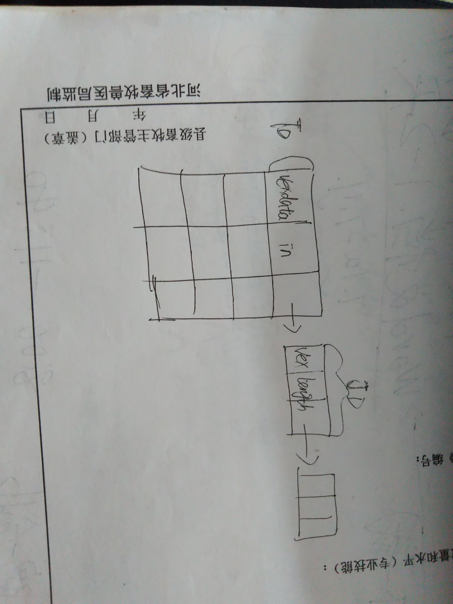
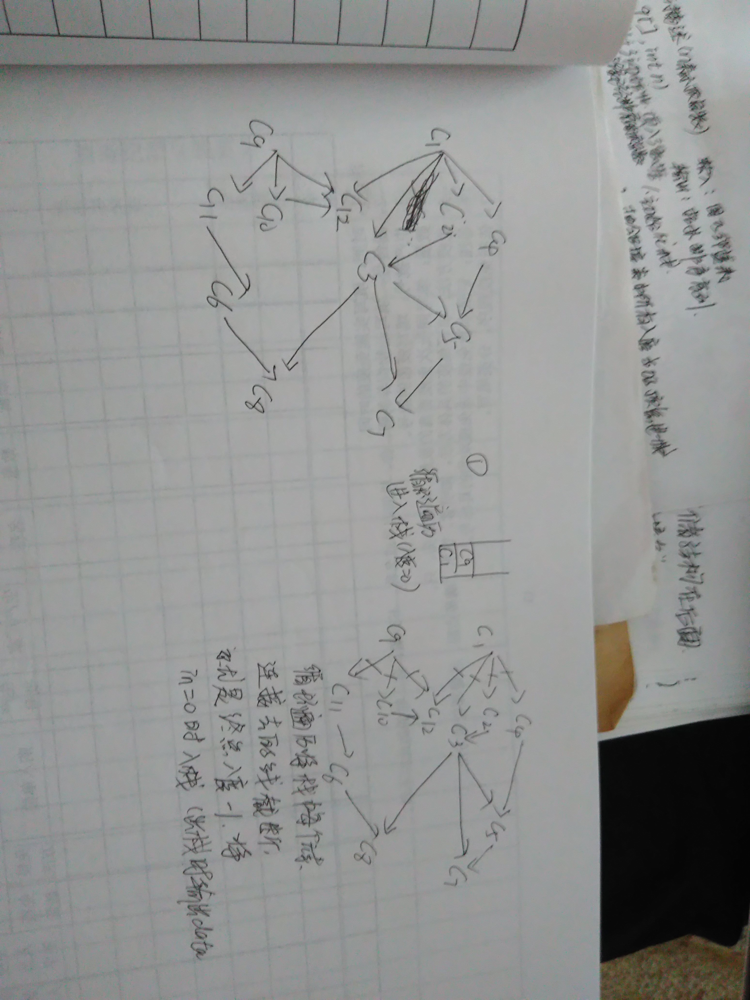

### 图的拓扑排序和关键路径

1. 拓扑排序

（1）应用：

    拓扑排序说的是任何事情都是有先后顺序的，做第二件事情之前就要保证第一件已经做过了。就是：有向图；线性序列；全部顶点。

    对于学生选修课程问题：顶点——表示课程；有向弧——表示先决条件，若课程i是j的先决条件，则图中有弧<i,j>。学生应按怎样的顺序学习这些课程，才能无矛盾、顺利地完成学业——拓扑排序。AOV网——用顶点表示活动，用弧表示活动间优先关系的有向图称为顶点表示活动的网(Activity On Vertex network)，简称AOV网。若<vi,vj>是图中有向边，则vi是vj的直接前驱；vj是vi的直接后继；AOV网中不允许有回路，这意味着某项活动以自己为先决条件。拓扑排序——把AOV网络中各顶点按照它们相互之间的优先关系排列成一个线性序列的过程叫拓扑排序。检测AOV网中是否存在环方法：对有向图构造其顶点的拓扑有序序列，若网中所有顶点都在它的拓扑有序序列中，则该AOV网必定不存在环。


2. 结构

有向图，先后顺序，使用邻接表最合适的。

增加了一个入度域，一个节点的出度是很容易确定的，但是入度很难确定，所以最好的方式就是在结构中增加这么一个字段，因为以后使用起来方便。



```c
//链表节点
typedef struct node
{
	int vex;//邻接点域
	int length;//权值
	struct node *next;//链域
}JD;

//表头结点
typedef struct 
{
	char vexdata;//数据域
	int in;//入度域
	struct node *firstarc;
}TD;
```

3. 图的初始化

```c
//链式图的创建
#define M 9//图的顶点数
#define N 11//图的边数
int creat(TD g[]){
	int i,j;
	JD *p=NULL;
	char ch1,ch2,c;
	int length=0;
	//*****注意：//因为以后要++所以这里要初始值，不初始值无法++，但是要写成count=count+1的形式***********
	//*****所以要养成定义一个变量就给初始值的习惯**********
	int count=0;

	//1.初始化g[i].vexdata
	printf("请输入所有顶点：\n");
	for(i=1;i<=M;i++)
	{
		scanf("%c",&c);
		g[i].vexdata=c;
		g[i].firstarc=NULL;

		//*******之前这里并没有进行初始化，即不管它，只为它开辟了空间***
		//该函数方法最后调用了incount(g);方法，在incount(g)方法中出现了g[k].in++语句，自增语句出现的前提是in已经有一个初始值了，
		//所以这里如果没有给定in初始值，对后面的方法执行是有误的。
		//********所以要记住：初始化时要将任何一个值进行初始化，即使现在可能用不到它，但是保不定以后可能会用到，所以一定要初始化*********
		g[i].in=0;

		//****吃掉回车符*****
		getchar();
	}

	//2.循环输入边，初始化链表节点
	//******这里就显示出count的作用了，作为循环判断的条件******
	while(count!=N)
	{
		printf("输入起点终点和边值：");
		scanf("%c%c%d",&ch1,&ch2,&length);
		//每次输入一个count++
		count++;
		i=local(g,ch1);
		j=local(g,ch2);
		//开辟内存空间
		p=(JD *)malloc(sizeof(JD));
		if(p==NULL)
			return 0;
		p->vex=j;
		p->length=length;

		//******注意对于p->next要分情况******
		if(g[i].firstarc==NULL)//这里少写了一个"="编译器编译运行都没有报错，但是输出结果错了
		{
			p->next=NULL;
		}
		else
		{
			p->next=g[i].firstarc;
		}
		g[i].firstarc=p;
		//*****易漏：吃掉回车****
		getchar();
		
	}

	//初始化in（入度）
	incount(g);
	return 1;
}
```

4. 求每个顶点的入度的算法

遍历TD数组的每个元素的每条链，初始化入度in

```c
//求每个顶点的入度算法
int incount(TD g[])
{
	JD *p;
	int i,k=0;

	//1.循环遍历链表节点
	//注意i的初始值是1
	for(i=1;i<=M;i++)
	{
		p=g[i].firstarc;
		while(p)
		{
			//2.根据得到的链表vex域，进行in++，然后指针继续移动
			k=p->vex;
			
			//出现该语句要提起重视：自增语句的前提是in已经进行了初始化，虽然在本方法中没有进行初始化，但是该方法是被int creat(TD g[])方法
			//调用的，已经给定了初始值in=0，所以这里是安全的。
			g[k].in++;

			p=p->next;
		}
	}
	return 1;
}
```

5. 其余函数

```c
//确定某顶点的下标
int local(TD g[],char u)
{

	//1.用k作为保存下标的辅助空间
	int k,i;

	//2.循环在g[]数组中进行查找
	for(i=1;i<=M;i++)
	{
		if(g[i].vexdata==u){
			k=i;
			//*******注意找到后及时的退出循环，避免占用资源****
			break;
		}
	}
	return k;
}

```
6. 拓扑排序



思路：

    循环遍历找到所有入度为0的点入栈
    循环遍历将栈中所有元素的指向的节点的入度减1，入度为0后入栈
    每次出栈的时候统计输出的节点的个数用来做后面的判断
    
    为什么使用栈这个辅助空间呢？
    因为栈的作用就是临时存储的，只是取出来的时候是有规律的，不是乱取出来的

```c
//拓扑排序  AOV网
//看重拓扑排序在实际生活中的意义
//拓扑排序：算法完成后有所有的节点，如果没有环是正确的。案例：(1)学生课程安排及课程学习顺序是有先后的，不可以出现矛盾，不可以出现环
//                                                   (2)一个工程有很多步骤，这些步骤也是有顺序的，不可以出现环的现象
//拓扑排序即：任何事情都有发生的前提，不可能以自己为前提
//顶点表示的是课程，弧表示的是先决条件。
int toposort(TD g[])
{   
    SqStack S;
    int m,j,k;
	JD *p=NULL;
	//1.初始化栈
	//拓扑排序需要一个辅助栈
    initSqStack(S);

    m=0;

	//2.入度为0的第一个进栈
    for(j=1;j<=M;j++)
	{
		if(g[j].in==0) 
			//进栈
			push(S,j);
	}

	//3.进入循环
     while(!empty(S))
     {  

		   //4.从栈中取出元素并输出
		   j=pop(S);
		   printf("%c",g[j].vexdata);

		   //5.计数器++,计数器的作用是为了判断循环结束之后是否有剩余的元素
		   m++;

		   //6.从出栈元素的表头开始向链表，所有链表节点的元素（通过指针进行移动）入度in--,当入度为0时进栈.
		   p=g[j].firstarc;
		   while(p!=NULL)
		   {     
			 k=p->vex;
			g[k].in--;
			if(g[k].in==0)
				push(S,k);
			p=p->next;
		   }
    }

   //最后从栈中取出元素后有剩余的情况
   if(m<M)  return 0;
   return  1;
}
```

7. 关键路径

（1）应用;

	拓扑排序无环使用的是AOV网，关键路径使用的是AOE网，AOE网表示活动的网

	前提：是一个带权的有向无环图。

	顶点表示事件，弧表示活动，权表示活动所需要的时间，AOE网用来估算工程的完成时间。

理解关键路径：完成一个项目至少使用的时间，项目中可能有并行的任务，这些使用的时间是不同的，找用时最大的那条路径，这就是关键路径


（2）结构

求关键路径，涉及到长度，存储的结构就应该是邻接矩阵，与上面的拓扑排序的数据结构，初始化操作等是一样的

（3）操作：

```c
//例  设一个工程有11项活动，9个事件
//事件 V1——表示整个工程开始
//事件V9——表示整个工程结束
//问题：（1）完成整项工程至少需要多少时间？
//      （2）哪些活动是影响工程进度的关键？----------------关键路径的求法------------


//关键路径：(1)得到任意一个事件发生的最早时间
//			(2)得到关键活动
//			(3)得到关键路径
//需要用到辅助数组ve[],vl[],ee,el
```

（3.1）事件发生的最早时间

思路：

	使用的大体上是拓扑排序的算法，因为求关键路径的前提就是一个非环
	与拓扑排序的区别：每次入度为0的节点出栈的时候，这个节点的下标进入另一个临时栈
	用一个数组ve[]存放每一个事件的最早发生时间，开始都是0，后来拓扑的时候修改，前一个事件的最早时间加上length,取最大的数值为最早时间。


	解释为什么又要使用一个栈T？ 因为拓扑排序的时候是需要一个栈S的，然后求事件开始的最晚时间的时候是需要倒序比较的，就是节点1->2,节点1的最晚时间=后一个节点的最晚时间-length，所以基于这种情况，就是后进先出，需要使用一个栈。

事件发生的最早时间看的是大值。

```c
//事件发生最早时间的类拓扑排序算法
//最早时间利用的是拓扑排序的算法，中间加上了另一个辅助栈T，T也是用来暂存数据，用于求最晚时间和关键活动的
int toposort2(TD g[],int ve[],SqStack &T)//数组的值会改变，T会改变
{
    SqStack S;
    int j,k,count;
	JD *p=NULL;
	//1.初始化辅助栈
    initSqStack(S);

    count=0;
    for(j=1;j<=M;j++)
	{
		//****注意这里是在拓扑上增加的，先初始化所有的ve[]数组初始值为0
		ve[j]=0;
		if(g[j].in==0)       
			push(S,j);
	}
	initSqStack(T);
     while(!empty(S))
     {  
		   j=pop(S);
		   //******注意这里与拓扑排序的不同，从栈中取出元素后不是输出了，而是推进另一个栈中********
		   //运行时词句出现错误的原因：(1)栈T没有初始化就使用，所以程序无法运行(2)初始化语句不应该放在循环中，会造成每次都重新创建栈T
		   //所以初始化栈放在循环外
		   //initSqStack(T);
		   push(T,j);

		   count++;
		   p=g[j].firstarc;
		   while(p!=NULL)
		   {    
			 k=p->vex;
			 g[k].in--;
			 if(g[k].in==0)
				push(S,k);
			 //*****注意这里也是在原来拓扑排序的基础上增加的代码******
			 //最早时间取最大的，与前面的比较
			if(ve[j]+p->length>ve[k])
				ve[k]=ve[j]+p->length;
			 p=p->next;
		   }
    }
   if(count<M)  return 0;
   return  1;
}
```


（3.2）事件发生的最晚时间，关键路径

思路：

	求最早时间的时候得到了一个栈，使用这个栈
	先求最晚时间，循环先都初始化为最后一个栈顶元素的最早时间，最晚时间=后一个时间-length,比较找最小的
	然后循环求关键路径：事件发生的最早时间=最晚时间

	事件发生的最晚时间看的是小值

```c
//最晚时间，关键活动，关键路径
int criticalpath(TD g[],int ve[],int vl[],SqStack &T)//*****如果需要使用T,函数之间可以进行交流的是函数参数和函数返回值**************
{
	int i,j,k,dut,ee,el;
	JD *p;

	//1.如果求最早时间的算法没有通过（拓扑排序事件不正常）
	if(!toposort2(g,ve,T))
		return 0;

	//2.初始化最晚时间数组vl[]每一个为最早时间的最后一个值
	for(i=1;i<=M;i++)
	{
		vl[i]=ve[M];
	}

	//3.利用T栈
	while(!empty(T)){
		for(j=pop(T),p=g[j].firstarc;p!=NULL;p=p->next)
		{
			k=p->vex;
			dut=p->length;

			//最长时间求最小值
			if(vl[k]-dut<vl[j])
				vl[j]=vl[k]-dut;
		}
	}
	//以上得到事件发生的最早和最晚时间数组ve[],vl[]
	//接下来得到关键活动和关键路径
	//逆序过程
	for(j=1;j<=M;j++)
	{
		for(p=g[j].firstarc;p;p=p->next)
		{
			k=p->vex;
			dut=p->length;

			//活动的最早时间为前面时间的最早时间（唯一的）
			ee=ve[j];
			//活动的最晚时间为后面时间的最晚时间减去权值
			el=vl[k]-dut;

			//得到关键活动：从j到k，活动长度为dut
			if(ee==el)
				printf("<%c,%c> %d\n",g[j].vexdata,g[k].vexdata,dut);
	
		}
	}

	//所有的关键活动输出完成之后就是关键路径
	return 1;
}

```

