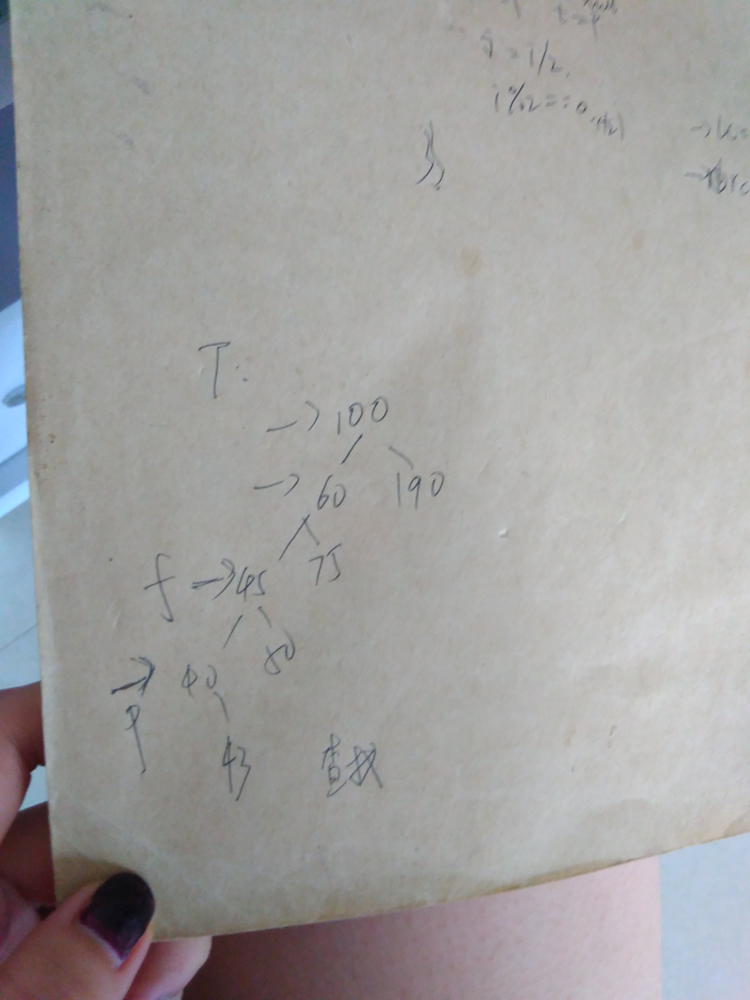

### 查找

    查找：
    
    静态查找表，动态查找表。
    静态查找表（只做查找的动作）：顺序表查找，有序表的折半查找，索引顺序表的分块查找，（静态树表的查找）
    动态查找表（查找的时候进行插入删除的动作）：二叉排序树，平衡二叉树，B-/B+树，键树

#### 静态查找表

1. 数据的存储结构不同，查找方式也不同
   
   顺序，链式
   
2. 线性表的顺序存储：顺序表查找，折半查找（前提是数据是有序的且是顺序存储的）

        顺序查找：就是从左到右一个挨一个的查找
        折半查找：就是从中间开始比较

```c
//静态查找
//顺序存储
typedef struct node
{
	int *base;
	int length;
	int size;
}list;
//初始化
void Init(list &L)
{
	int i;
	L.base=(int *)malloc(100*sizeof(int));
	if(!L.base)
		return;
	L.length=0;
	L.size=100;
	for(i=1;i<10;i++)
	{
		L.base[i]=i;
		L.length++;
	}

}
//1.顺序查找
int Find1(list L,int k)
{
	int i;
	for(i=1;i<10;i++)
	{
		if(L.base[i]==k)
			return i;//返回位置
	}
		return -1;
}
//2.折半查找(有序的数组)
int Find2(list L,int k)
{
	int low,high,mid;
	low=1;
	high=L.base[L.length];
	while(high>low)
	{
		mid=(low+high)/2;
		if(L.base[mid]==k)
			return mid;
		if(k>L.base[mid])
			low=mid+1;
		else if(k<L.base[mid])
			high=mid-1;
	}
	return -1;
}

```

平均查找长度ASL:指的是每一个元素查找成功的概率之和

（1）顺序查找（在肯定能查找成功的前提下）：


如果也考虑查找失败的情况：


假设每一个的查找概率都是1/n,第一个元素的ASL=1*1/n,第二个元素的ASL=2*1/n,.....所以在等概率的情况下顺序表的平均查找长度是ASL=(1/n)*[n*(n+1)/2]=(n+1)/2;

（2）折半查找：


折半查找的ASL（性能分析）:

折半查找的查找过程类似于判定树（有序二叉树）：


二叉树每层的节点的个数最多是2(j-1)次方，假定每个元素的查找概率都是1/n,第一个元素的ASL=1*1/n*2(1-1)（后边这个括号是次方）
第二个元素ASL=2*1/n*2(2-1)（后边这个括号是次方）：其实就是计算每一个元素的查找长度，求总和。


（3）索引顺序表查找（分块查找）：

块内无序，块间有序，索引表上层存的是某块最大的数值，下层存的是该块第一个元素的开始地址。


注意：几种查找方式的比较


#### 动态查找表

不仅进行查找的动作，还进行插入删除的动作。表的结构是在查找的过程中动态生成的，就是查找K，如果存在返回查找成功，如果不存在，就插进去。

这里的动态查找，使用的存储结构式是：二叉排序树。

1. 二叉排序树

（1）二叉排序树概念：

	对顺序存储的数据可以进行折半查找，从小到大排序的数据如果用二叉树来存储就是判定树（二叉排序树），二叉排序树就是左边都是小数值，右边都是大数值

	二叉排序树进行中跟遍历的时候就是从小到大排序的数据。

	所以在查找数据的时候如果也需要进行插入或删除的操作的话，数据的存储结构就使用链式存储的二叉排序树存储。

（2）二叉排序树的存储结构：

```c
#define N 10
//链式存储
typedef struct node
{
	int vexdata;//数据
	int i;//号
	struct node *lchild,*rchild;//左右孩子指针
}tre,*Tree;
```

（3）. 二叉排序树的完整操作：

	由于二叉排序树的出现是为了进行查找的操作，所以他的初始化只是简单的创建一个跟，具体的添加数据是在查找的过程中进行动态初始化的。

分析删除：

	deleteTree()是递归进行查找
	delete是找到了具体的删除
```c
//1.初始化一棵二叉排序树
void InitTree(Tree T,int visit[],int n,int data[])
{
	int i;
	for(i=1;i<=8;i++)
		visit[i]=0;
	T=(int *)malloc(sizeof(int));
	if(!T)
		return ;
	T->vexdata=data[1];
	T->lchild=T->rchild=NULL;
	visit[1]=1;


}
```
```c
//2.查找
//k是要查找的数据，p是要返回查找到的返回一棵树，f是要查找的树的父亲，查找到了之后，将树存储在p中返回，查找不到返回父类（NULL或者某一侧最后的节点）。
//查找到了之后这棵树用P指针进行指向，返回一个查找结果。
//查找之后不仅返回一个结果，而且还会有一个指针指向用来插入的时候使用。
int Find(Tree T,int k,Tree f,Tree &p)//即使p为指针，任然可以返回给它
{
	if(!T)
	{
		p=f;//这里解释为什么使用一个父亲指针f,因为如果没有查找到的话返回的是父亲树，不是NULL就是最后的一个节点。
		return 0;
	} 
	else if(T->vexdata==k)
	{
		p=T;
		return 1;
	}
	else if(k<T->lchild->vexdata)
	{
		return Find(T->lchild,k,T,p);//左孩子进行相同的操作，递归
	}
	else 
		return Find(T->rchild,k,T,p);

}
```



```c
//3.插入
//因为是有序的二叉树，插入的时候要先找合适的位置，就是要先进行查找的动作，查找停在一个合适的位置正好就是插入的位置。这样仍然是有序的二叉树
//插入这里使用了查找时最后定位的指针p了，因为p的位置就是插入的位置。

int InsertTree(Tree &T,int k,Tree p)
{
	Tree s;
  //插入这个节点之前，先判断这个节点在有序树中是否存在
  //查找后的树用P指针指着
	if(!Find(T,k,NULL,p))
	{
		s=(int *)malloc(sizeof(int));
		if(!s)
			return 0;
		s->vexdata=k;
		s->lchild=s->rchild=NULL;
		if(!T)
			T=s;
		else if(k<p->vexdata)
			p->lchild=s;//这里直接使用p->lchild，因为find方法查找的时候p指针会最后停留在一个位置（左侧或者右侧的最后），在这个位置的附近进行插入即可
		else
			p->rchild=s;
		return 1;
	}
	else 
	 return 0;//没有插入就返回0
}
```


```c
//4.删除
//这里是删除方法借用的方法
//删除时候仍然要保证是有序的二叉树。
//这个方法的意思就是删除T，但是知道T的父亲是f。
int Delet(Tree &T,Tree f)
{
	Tree q;
	int j;
	//f->i=(T->i)/2;
	Tree s;
	if(!T->rchild)
	{
		if(T->lchild)
		{
			if(f->lchild==T)
				f->lchild=T->lchild;
			else
				f->rchild=T->lchild;
		}
		else
		{
			if(f->lchild==T)
				f->lchild=NULL;
			else
				f->rchild=NULL;
		}
	}
	else
	{
	
		if(!T->lchild)
		{
			if(f->lchild==T)
				f->lchild=T->rchild;
			else 
				f->rchild=T->rchild;
		}
		else//左右孩子都有
		{
			q=T->lchild;
			while(q->rchild)
			{
				s=q;//新的Q的父类
				q=q->rchild;
				
			}
			T->vexdata=q->vexdata;
			//f->in=(q->in)/2;
			if(q->lchild)
			{
				s->rchild=q->lchild;
			}
			else 
				s->rchild=NULL;
		}
	}

}
//4.删除
//这个是删除方法开始
//这个删除的方法也使用到了一个父类
//解释这个f的使用：因为delete方法需要使用到要删除的节点的父类，所以找到这个点，也要传递过去父类是谁。
//参数：在某棵树里面删除某个点，找到的时候删除的同时要操作父亲，所以要传递过去。
//下面的递归调用实际上就是查找的过程，只是没有使用上面的查找的方法。
int DeletTree(Tree &T,int k,Tree f)
{
	if(!T)
		return 0;
	else if(T->vexdata==k)
		return Delet(T,f);//这里最清楚父亲是谁。
	else if(T->lchild->vexdata>k)
		return DeletTree(T->lchild,k,T);//递归调用
	else 
		return DeletTree(T->rchild,k,T);
}
```


```c

//5.输出
void OutPut(Tree T)
{
	//利用树的中序遍历  从小到大


}
void main()
{
	int visit[N];
	Tree T,p=NULL;
	int k;
	int ret;
	int data[N]={49,38,67,97,76,13,27,50};
	InitTree(T,visit,N,data);
	printf("请输入查找元素：");
	scanf("%d",&k);
	ret=Find(T, k,NULL,p);
	if(ret==1)
	{
		printf("查找成功！");
		return;
	}
	printf("\n插入的结果：");
	InsertTree(T,k,p);
	OutPut(T);
	printf("\n请输入查找元素：");
	scanf("%d",&k);
	ret=Find(T, k,NULL,p);
	if(ret==1)
	{
		printf("查找成功！");
		return;
	}
}
```

二叉排序树的查找就是和有序数据的折半查找是一样的吗？平均查找长度ASL？

2. 平衡二叉树

（1）概念：
每一个节点的左子树的高度与右子树的高度差的绝对值是0，1是平衡的，大于1就是不平衡的，这个数值就是平衡因子。

（2）创建一个平衡二叉树

出现危机时的调整策略：


举例：


3. 哈希查找

使用：


