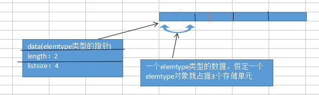

### 数据库

#### 第一章 绪论

1. 数据结构的定义：（R,D）=（集合，关系）

2. 算法看重两点：

（1）健壮性 

（2）效率

3. 效率：时间复杂度 ,就是语句执行的频度，语句重复执行的次数,这里指的是最坏情况下的时间复杂度
   
       对数（log）<线性(kx)< 二次多元(2x2)<三次及以上多元(x3)<指数（2n）

       (1)T(n)=O(n2);平方

       ```c
       for(int i=0;i<n;i++){
        for(int j=0;j<n;j++){
          x ++;
          x = x + 2;
        }
       }
       ```

       (2)T(n)=O(1);

       ```c
       {x++;j=j+1;}
       ```

       (3)T(n)=O(n);

       ```c
       for(int i=0;i<n;i++){
         x++;
         j=j+1;
       }
       ```

       (4)T(n)=O(la*lb);嵌套函数

       ```c
       la = init(a);lb = init(b);
       for(int i=la;i<n;i++){
         x++;
         location(lb,i);//与lb有关
       }
       ```

       (5)T(n)=O(la+lb);嵌套函数

       ```c
       la = init(a);lb = init(b);
       while(i<=la && j <= lb){
        x++;
       }
       //下面两个最多只会执行其中的一个
       while(i<=la){
        y++;
       }
       while(j<=lb){
        z++;
       }
       ```
#### 第二章 线性表

1. 线性表特点

线性表中是一个个的元素，或者一个个的记录

（1） 唯一的第一个元素，唯一的最后一个元素

（2） 每个元素的位置固定

（3） 长度就是元素的个数，可以灵活变化

2. 线性表表示：顺序表示，链式表示

3. 顺序表示及实现

（1）顺序表示指的是：地址连续的存储单元一次存放数据元素

（2）区分：存储地址，存储单元，存储容量

存储地址：地址

存储单元：int型占用4个存储单元

存储容量：占用的存储单元的数量


（3） 定义存储结构：顺序表
```c
typedef struct
{
	char name[10];
	char tel[10];
	char class1[10];
}elemtype;
typedef  struct
{
	elemtype *data;//相当于结构体数组的首地址
	int length;
	int listsize;
}list;//指明的类型叫做list
```



（4）顺序表的操作：初始化，插入，删除，查找

初始化涉及到从文件到瑞数据；插入删除考虑位置是头，中间，尾部；数组问题涉及到越界

(4.1) 顺序表的初始化：开辟数组空间，判断是否开辟成功，初始化length，size
```c
//涉及到文件的导入
int init_list(list &la)
{
	FILE *fp;
	int i;
	//1.动态开辟内存空间
	la.data=(elemtype *)malloc(4*sizeof(elemtype));//使用sizeof(elemtype)有助于实现跨平台性	
       if(la.data==NULL)
		return 0;
	//2.打开文件并读取文件
	if((fp=fopen("student.txt","r"))==NULL)
		return 0;
	while(!feof(fp))
	{
		for(i=0;i<5;++i)
		{
			fscanf(fp,"%s %s %s",la.data[i].name,la.data[i].tel,la.data[i].class1);//只进行了文件的导入
																					//如果使用的是%d,则后面的要加上“&”
		}
	}//（1）
	//使用while循环是为了保证随时都满足条件才可以进行。比如进行到（1）处，
	  //如果为if不会再进行条件的判断直接跳出往下走了，但是这里是while，会进行条件的判断，
	   //满足条件时会再一次进入循环运行。
	//3.关闭文件
	fclose(fp);
	//4.设置length和size
	la.length=5 ;
	la.listsize=4;

	return 1;	
}


//不涉及到文件的导入
int init_list(list &la)
{
	la.data=(elemtype *)malloc(100*sizeof(elemtype));
	if(la.data==NULL)
		return 0;
	la.length=5 ;
	la.listsize=100;

	return 1;	
}
```


（4.2）插入:插入位置是否合适；空间是否满了，满了要重新动态扩展，重新执行，重新初始化；移动数据；修改length;返回插入状态

```c
//在某位置插入元素
//这个方法只适用于非尾部
int insert_list(list &la,int i,elemtype e)
{
	elemtype *newbase,*p,*q;
	//1.判断插入位置是否合理，注意：位置和下标是不同的
	if(i<1||i>la.length+1)
		return 0;
	//2.判断是否栈满，并重新开辟新的内存空间，更新size
	if(la.length>=la.listsize)
	{

	    newbase=(elemtype*)realloc(la.data,(la.listsize+10)*sizeof(elemtype));
	    if(!newbase) 
		   return 0;
	    else
		{
		   la.data=newbase;
	       la.listsize+=10;
		}
	}
	//3.设置指针，移动数据
	q=&la.data[i-1];
	//移动数据
	for(p=&(la.data[la.length-1]);p>=q;--p)
		*(p+1)=*p;
	//4.插入数据，更新length
	*q=e;
	++la.length;

	return 1;
}

//在尾部插入元素
int insert(list &la,elemtype e)
{
	elemtype *newbase;
	//1.判断是否栈满，并重新开辟新的内存空间，更新size
	if(la.length>=la.listsize)
	{

	    newbase=(elemtype*)realloc(la.data,(la.listsize+10)*sizeof(elemtype));
	    if(!newbase) 
		   return 0;
	    else
		{
		   la.data=newbase;
	       la.listsize+=10;
		}
	}
	//2.插入数据
	la.data[la.length]=e;
	//3.更新length
	la.length++;

	return 1;
}
```


（4.3）删除：删除的位置；移动数据；删除状态

```c
//按位置删除
int del_list(list &la,int i,elemtype &e)
{
	elemtype *p,*q;
	//1.删除位置合理
	if(i<1||i>la.length)
	   return 0;
	e=la.data[i-1];
	//2.移动数据
	q=la.data+la.length-1;
	for(p=&la.data[i]; p<=q;p++)//这里存在一个问题：如果位置i就是结尾处直接这样使用就有越界的风险，最好删除尾部的方法单独写
		*(p-1)=*p;
	//3.更新length
	la.length--;

	return 1;
}
//按人名删除
int del_list(list &la)
{
	char name[10];
	elemtype *p,*q;
	int i;
	//1.确定字符串
	printf("请输入要删除的学生姓名：");
	scanf("%s",name);
	//2.循环查找
	for(i=0;i<la.length;i++)
	{
		if(strcmp(la.data[i].name,name)==0)
		{
			//3.移动数据
			q=la.data+la.length-1;
			for(p=&la.data[i+1]; p<=q;p++)
				*(p-1)=*p;
			//4.找到目标后退出循环
			break;
		}
	}
	//5.确认是否删除成功
	if(i>=la.length)
	{
		printf("\n没有该学生\n");
	    return 0;
	}
	else return 1;//找到了
}
```

（4.4）查找：
 ```c
 int findname(list &la)
{
	int i;
	char name[10];
	//1.输入要查找的字符串
	printf("请输入要查找的姓名：");
	scanf("%s",name);
	elemtype e;
	//2.循环找到字符串
	for(i=0;i<la.length;i++)
	{
		if(!strcmp(name,la.data[i].name)) 
		{
			e=la.data[i];
			printf("%s %s %s\n",la.data[i].name,la.data[i].tel,la.data[i].class1);
			//3.找到字符串并及时退出循环
			break;
		}
	}
	//4.确认是否查找成功
	if(i>=la.length)
	{
		printf("没有找到该学生\n");
		return 0;
	}
		printf("查找成功");
		return 1;
}
 ```
 
(4.5) 销毁:清空内容；置NULL指针
 ```c
 free(la);
 la = NULL;
 ```
 为什么要进行上述两个操作呢？
 
 因为free只是把存储位置的数据清空了，没有数据了，但是指针还指在那个位置，所以避免成为野指针，要将指针置为NULL

（4.6）清空：只需要free(la),没有数据了，但是还要占据着位置

（5） 课本上的例子：

（5.1）A=AUB 去掉重复

循环遍历B：for

从B中取出每一个元素GetElem(i)

该元素在A中是否存在（LocatonElem(e)，这个方法如果A是有序的，可以减小时间复杂度），存在就开始下一次循环，否则将该元素插入到A中insertInto(e)

（5.2）C=AUB:A,B均是有序的，结果也希望是有序的，C元素是允许重复的有序的

动态开辟C的内存空间：init(C)

分别有三个指针指针a,b,c

a,b比较:a>b时，*c=*b,b++,c++继续比较a,b;a<b时，*c=*a,a++,c++继续比较a,b;a==b时，*c=*a,c++，*c=*b,a++,b++,c++继续比较a,b

无论A,B谁先比较完，将剩下的一次放进C中，指针进行操作


### 顺序表的特点：查找快，插入删除慢，因为要移动数据

